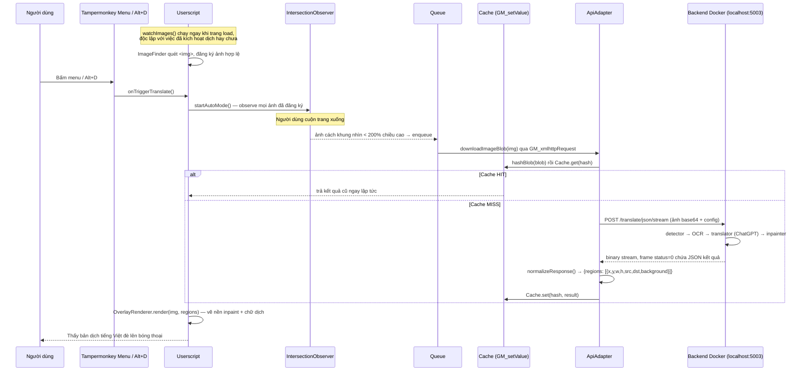

# Manga Overlay Translator — Tài liệu tổng quan

> Tài liệu này giải thích **toàn bộ dự án** từ đầu đến cuối: mục tiêu, kiến trúc, từng khái niệm nền tảng (kể cả nhỏ nhất), toàn bộ luồng dữ liệu, và lý do đằng sau từng quyết định kỹ thuật. Đọc file này là đủ để hiểu dự án mà không cần đọc lại lịch sử chat.
>
> Các tài liệu khác trong thư mục: `spec-manga-overlay-translator.md` (spec gốc) là bản đặc tả ban đầu; `README.md` là ghi chép chi tiết về backend (Giai đoạn A+B); file này (`docs.md`) là bức tranh toàn cảnh, viết sau khi mọi thứ đã chạy được.

---

## Cài đặt (khuyến nghị: Extension)

1. Mở `chrome://extensions/` (hoặc `edge://extensions/`), bật **Developer mode**.
2. Bấm **Load unpacked**, chọn thư mục `extension/` trong repo này.
3. Bấm icon extension trên toolbar (hoặc Alt+D) để bắt đầu dịch trang đang xem, Alt+T để bật/tắt so sánh gốc/dịch.

**Nếu trước đây đã cài `manga-overlay-translator.user.js` qua Tampermonkey: tắt hoặc gỡ script đó đi** trước khi dùng extension — để cả 2 cùng bật trên 1 trang sẽ khiến cả userscript lẫn extension tự tìm ảnh và dịch song song, tạo ra 2 lớp overlay chồng nhau/dịch trùng.

### Cài đặt cũ qua Tampermonkey (không còn khuyến nghị, giữ lại tham khảo)

File `manga-overlay-translator.user.js` vẫn khả dụng để tham khảo, nhưng **không còn được khuyến nghị**. Để sử dụng nó (không khuyến khích):
1. Cài đặt extension [Tampermonkey](https://www.tampermonkey.net/)
2. Tạo script mới, dán nội dung của `manga-overlay-translator.user.js`
3. Lưu và kích hoạt

Ưu điểm userscript cũ: không cần developer mode. Nhược điểm: không còn được bảo trì, extension mới là phiên bản chính thức.

---

## 1. Dự án này làm gì

**Mục tiêu:** đọc truyện tranh raw (tiếng Nhật/Hàn/Trung) trên bất kỳ website nào, tự động dịch sang tiếng Việt và **vẽ đè bản dịch lên đúng vị trí bóng thoại**, ngay trong lúc cuộn trang đọc — không cần tải ảnh về, không cần dùng công cụ dịch riêng.

**Trong phạm vi:**
- Ảnh truyện là thẻ `` bất kỳ trên trang web (không giới hạn danh sách site)
- Cả manga dạng trang rời (Nhật) và webtoon dạng cuộn dài (Hàn)
- Backend chạy ở máy của chính mình (không dùng dịch vụ cloud trả phí)
- Chỉ phục vụ 1 người dùng (chính là người viết ra nó)

**Ngoài phạm vi (cố tình không làm):** desktop app, đọc file local (CBZ/PDF), tài khoản/thanh toán, deploy backend lên internet, giao diện cài đặt, đa ngôn ngữ đích khác ngoài tiếng Việt.

**Hai nguyên tắc kiến trúc cốt lõi** (mọi quyết định sau này đều xoay quanh 2 điều này):

1. **Chỉ có 1 module duy nhất biết "hình dạng" dữ liệu backend trả về** (`ApiAdapter`). Toàn bộ phần còn lại của userscript chỉ làm việc với một cấu trúc dữ liệu nội bộ đã được chuẩn hóa (`{ regions: [{x, y, w, h, src, dst, background}] }`). Nếu backend đổi cách trả dữ liệu, chỉ cần sửa đúng 1 chỗ.
2. **Backend không vẽ chữ lên ảnh. Trình duyệt tự vẽ bằng CSS/HTML.** Backend chỉ có nhiệm vụ: tìm bóng thoại ở đâu (tọa độ) + dịch chữ trong đó là gì (text). Việc "dán" chữ dịch lên đúng vị trí, chọn font, canh giữa, tự co giãn cỡ chữ... là việc của trình duyệt. Điều này giúp: không phụ thuộc font tiếng Việt của backend, không cần bật tính năng "vẽ lại ảnh" nặng nề của backend cho phần chữ, và **chữ dịch vẫn bôi đen/copy được** như chữ thường trên web.

---

## 2. Các khái niệm nền tảng cần biết trước

Phần này giải thích từng khái niệm/công nghệ xuất hiện trong dự án, kể cả những cái tưởng "hiển nhiên", vì các phần sau sẽ dùng lại chúng liên tục.

### 2.1 Userscript là gì, khác gì "extension"

Một **extension** (tiện ích mở rộng trình duyệt, ví dụ Chrome Extension) là 1 gói phần mềm hoàn chỉnh: có `manifest.json` khai báo quyền hạn, có thể có "background script"/service worker chạy ngầm, cần build (đóng gói, có thể cần TypeScript/bundler như Webpack), và phải cài qua Chrome Web Store hoặc "Load unpacked" thủ công.

Một **userscript** đơn giản hơn nhiều: nó chỉ là **1 file JavaScript duy nhất** (`.user.js`), có 1 khối comment đặc biệt ở đầu file (`// ==UserScript== ... // ==/UserScript==`) khai báo tên, quyền cần cấp, trang nào script này chạy trên đó. Để chạy được userscript, trình duyệt cần cài sẵn 1 extension "trình quản lý userscript" — ở đây là **Tampermonkey**. Sau đó chỉ cần paste nội dung file `.user.js` vào Tampermonkey là chạy ngay, không build, không đóng gói.

Dự án này **cố tình chọn userscript thay vì extension** vì lý do kỹ thuật quan trọng ở mục tiếp theo (CORS/mixed-content).

### 2.2 Tampermonkey và các quyền `GM_*`

Tampermonkey cấp cho userscript một số hàm đặc biệt mà JavaScript thường của trang web không có quyền dùng, gọi là `GM_*` API (Greasemonkey Manager). Khai báo `// @grant GM_xxx` ở đầu file là "xin quyền" dùng hàm đó. Dự án dùng:

- **`GM_xmlhttpRequest`** — giống `fetch()`/`XMLHttpRequest` bình thường, nhưng **bỏ qua CORS và "mixed content"** (xem 2.3). Đây là lý do userscript được chọn: nếu dùng extension với Manifest V3 hiện đại, việc gọi request tuỳ ý tới `localhost` từ context của trang HTTPS bất kỳ bị giới hạn rất nhiều bởi chính sách bảo mật mới của Chrome. `GM_xmlhttpRequest` không bị giới hạn này.
- **`GM_setValue` / `GM_getValue`** — lưu trữ dữ liệu **vĩnh viễn**, tồn tại qua các lần tải lại trang, dùng làm cache (mục 5.3).
- **`GM_addStyle`** — chèn 1 khối CSS vào trang, dùng để định nghĩa các class `.mot-*` cho overlay.
- **`GM_registerMenuCommand`** — thêm 1 mục vào **menu popup của chính Tampermonkey** (bấm icon Tampermonkey trên thanh công cụ trình duyệt sẽ thấy). Đây là cơ chế kích hoạt dịch cuối cùng được chọn (xem mục 6.7 — lý do khá dài, có cả 1 "cuộc điều tra").
- **`@connect`** — danh sách domain userscript được phép gọi `GM_xmlhttpRequest` tới. `@connect localhost`, `@connect 127.0.0.1` (gọi backend), `@connect *` (tải ảnh gốc từ CDN bất kỳ của site truyện).
- **`@run-at`** — thời điểm script bắt đầu chạy so với vòng đời tải trang (xem 2.8 — quan trọng trong "vụ" quảng cáo chặn click).

### 2.3 CORS, "mixed content", và tại sao không dùng `fetch()` thường

- **CORS** (Cross-Origin Resource Sharing) là cơ chế trình duyệt chặn 1 trang web (A) tự ý đọc dữ liệu từ 1 domain khác (B) bằng JavaScript, trừ khi B cho phép rõ ràng qua header đặc biệt. Đây là cơ chế bảo vệ người dùng khỏi website độc hại đánh cắp dữ liệu từ site khác mà bạn đang đăng nhập.
- **Mixed content** là khi 1 trang tải qua **HTTPS** (an toàn) lại cố gắng gọi 1 tài nguyên qua **HTTP** thường (không mã hoá) — trình duyệt sẽ chặn việc này để tránh kẻ tấn công chèn nội dung giả vào giữa đường truyền. Backend của dự án chạy ở `http://127.0.0.1:5003` (HTTP thường), trong khi hầu hết site đọc truyện dùng HTTPS → nếu dùng `fetch()` bình thường từ trang HTTPS gọi tới backend HTTP, trình duyệt sẽ chặn ngay lập tức.
- **Giải pháp:** `GM_xmlhttpRequest` không bị 2 giới hạn trên, vì nó không chạy trong "ngữ cảnh" JavaScript thông thường của trang — nó chạy với quyền của chính Tampermonkey (một extension), vốn được trình duyệt tin tưởng hơn trang web thường.

### 2.4 Tainted canvas (canvas bị "nhiễm bẩn")

`<canvas>` là 1 thẻ HTML cho phép vẽ đồ hoạ bằng JavaScript (`CanvasRenderingContext2D`), và có thể đọc lại dữ liệu điểm ảnh đã vẽ (`getImageData()`) hoặc xuất ra file ảnh (`toBlob()`). Nhưng nếu bạn vẽ lên canvas 1 tấm ảnh tải từ **domain khác** (cross-origin) mà không qua CORS hợp lệ, trình duyệt sẽ đánh dấu canvas đó là **"tainted" (nhiễm bẩn)** — từ lúc đó, mọi thao tác đọc lại dữ liệu (`getImageData`, `toBlob`, `toDataURL`) sẽ ném lỗi `SecurityError`, để tránh 1 trang web dùng `<canvas>` như "cửa hậu" đọc trộm ảnh riêng tư của site khác.

Ảnh truyện tranh trên các site đọc truyện gần như luôn nằm ở CDN khác domain với chính site đó → nếu code vẽ trực tiếp từ thẻ `` của trang lên `<canvas>` thì canvas sẽ bị tainted. Dự án né việc này bằng cách: **luôn tải ảnh về dưới dạng `Blob`** (dữ liệu nhị phân thô, không gắn với "nguồn gốc" nào) qua `GM_xmlhttpRequest` trước, rồi mới vẽ `Blob` đó lên canvas (`createImageBitmap(blob)`) — lúc này canvas không bị coi là tainted vì dữ liệu không "mang quốc tịch" của domain nào nữa.

**Trường hợp đặc biệt — ảnh `blob:`/`data:` URL:** một số site (thường là site đọc truyện chính thống, chống scrape) không đặt `` là URL CDN thật, mà tự tải ảnh về bằng JavaScript của chính họ rồi tạo ra 1 **`blob:` URL cục bộ** (`URL.createObjectURL()`) để gán vào `src` — và **thu hồi nó ngay sau khi trình duyệt giải mã xong** (`URL.revokeObjectURL()`), để không ai tải lại được nữa qua mạng (kể cả chính họ). Gặp trường hợp này, `GM_xmlhttpRequest`/`fetch` tải lại `src` đó **luôn thất bại** (`net::ERR_FILE_NOT_FOUND`) vì dữ liệu không còn tồn tại — không liên quan gì đến CORS hay sandbox của Tampermonkey. Nhưng vì `blob:`/`data:` URL được trình duyệt coi là **cùng gốc (same-origin)** với trang đã tạo ra nó (khác hẳn ảnh cross-origin thật từ CDN), nên `drawImage()` **trực tiếp từ chính thẻ `` đang hiển thị** (đọc thẳng pixel đã giải mã sẵn trong bộ nhớ trình duyệt, không cần tải lại qua mạng) **không** làm canvas bị tainted — đây là cách `downloadImageBlob()` xử lý riêng cho 2 loại URL này (`imageElementToBlob()`).

### 2.5 Docker và vì sao backend chạy trong container

**Docker** là công cụ đóng gói 1 chương trình cùng toàn bộ môi trường nó cần (hệ điều hành thu nhỏ, thư viện, phiên bản Python...) thành 1 "container" chạy độc lập, không phụ thuộc máy thật đã cài gì. Backend `manga-image-translator` (dự án mã nguồn mở, xem mục 3) được phân phối sẵn dưới dạng 1 Docker image (`zyddnys/manga-image-translator:main`), nên chỉ cần `docker run` là có ngay môi trường Python + PyTorch + các model AI đã cài đặt đúng, không cần tự cài Python/CUDA/thư viện thủ công (vốn rất dễ xung đột phiên bản).

**GPU passthrough:** container mặc định không thấy được card đồ hoạ (GPU) của máy thật. Cờ `--gpus all` khi chạy `docker run` yêu cầu Docker "chia sẻ" GPU vào trong container — bắt buộc phải có để chạy AI nhanh (dùng CPU sẽ chậm hơn 10–20 lần).

**WSL2:** trên Windows, Docker Desktop không chạy container trực tiếp trên Windows mà chạy bên trong 1 máy ảo Linux nhẹ gọi là WSL2 (Windows Subsystem for Linux 2). Đây là lý do các lệnh Docker gốc hay dùng cú pháp bash (`\` để xuống dòng, `$(pwd)`) thay vì PowerShell.

**VRAM vs "shared memory":** GPU laptop dùng trong dự án có 4GB bộ nhớ chuyên dụng (VRAM, gắn liền trên card). Windows Task Manager thường hiển thị số "GPU Memory" lớn hơn nhiều (~12GB) vì nó cộng thêm cả RAM hệ thống mà GPU "mượn tạm" qua khe cắm PCIe — nhưng PyTorch (thư viện AI) **không dùng được phần mượn tạm này để tính toán**, nó chỉ dùng đúng 4GB VRAM thật. Đây là lý do phải luôn kiểm tra bằng lệnh `nvidia-smi` (cho số thật) chứ không tin Task Manager, và phải cẩn thận với các cấu hình AI "nặng" (ảnh lớn, model to) vì rất dễ hết bộ nhớ (OOM — Out Of Memory).

### 2.6 Pipeline dịch ảnh — OCR, detection, inpainting, translation nghĩa là gì

Backend xử lý 1 ảnh truyện qua 1 chuỗi bước AI nối tiếp nhau:

1. **Detector (dò vùng chữ)** — 1 model AI quét toàn bộ ảnh, tìm ra những vùng hình chữ nhật (bounding box — viết tắt **bbox**) có khả năng chứa chữ viết (thường là bóng thoại). Nó KHÔNG đọc được nội dung chữ, chỉ trả về "ở đây có chữ, tọa độ x,y,rộng,cao là..."
2. **OCR (Optical Character Recognition — nhận dạng ký tự quang học)** — với mỗi vùng detector tìm được, 1 model khác "đọc" ảnh và chuyển thành text thật (ví dụ nhận ra pixel đó là chữ Nhật "こんにちは"). Đây là bước duy nhất "hiểu" được ký tự gốc là gì.
3. **Translator (dịch)** — nhận text gốc từ OCR, dịch sang ngôn ngữ đích (ở đây gọi 1 LLM — ChatGPT — qua API, không dùng model dịch offline).
4. **Inpainter (tùy chọn — xóa chữ gốc)** — 1 model AI "vẽ lại" vùng ảnh chứa chữ gốc sao cho trông như chưa từng có chữ ở đó (dựa vào việc "đoán" hình nền/nét vẽ xung quanh nên là gì) — về bản chất là kỹ thuật **image inpainting** (phục hồi ảnh) dùng để xóa vật thể không mong muốn, ở đây dùng để xóa chữ.
5. **Renderer (tùy chọn — vẽ chữ mới lên ảnh)** — nếu bật, backend sẽ tự vẽ luôn chữ đã dịch lên ảnh đã inpaint, trả về **1 ảnh hoàn chỉnh**. Dự án này **tắt bước này** (`renderer: "none"`, xem Nguyên tắc kiến trúc #2) vì tự vẽ bằng CSS linh hoạt hơn.

Dự án chỉ dùng bước 1–3 và bật riêng bước 4 (inpaint) để lấy ảnh nền đã xóa chữ, còn bước 5 luôn tắt.

### 2.7 CSS overlay: `position: absolute`, tọa độ theo %, `pointer-events`

Kỹ thuật vẽ chữ dịch đè lên ảnh, **không sửa gì trên chính thẻ ``** (kể cả DOM lẫn CSS — xem lý do quan trọng ở mục 6.9):

- Tạo 1 `<div class="mot-layer" style="position: absolute">`, gắn **trực tiếp vào `document.body`** (không bọc/không di chuyển ``), rồi tự tính đúng `left/top/width/height` (đơn vị px) khớp với vị trí/kích thước hiển thị thật của `` bằng `img.getBoundingClientRect()` (trả toạ độ theo **viewport**) cộng thêm `window.scrollX/scrollY` (để quy về toạ độ **trang**, vì `position: absolute` — khác `position: fixed` — vẫn tự cuộn theo trang bình thường một khi đã đặt đúng toạ độ tuyệt đối 1 lần).
- Mỗi vùng chữ được vẽ bằng 1 `<div>` con **bên trong** layer đó, định vị bằng **phần trăm** (`left: (x/naturalWidth*100)%`) thay vì pixel tuyệt đối — vì % tự động tính lại theo kích thước của chính layer cha (đã được đặt đúng bằng px ở bước trên), nên khi người dùng zoom trình duyệt hoặc resize cửa sổ (kèm 1 `ResizeObserver` theo dõi `` + 1 listener `window resize`, gọi lại việc tính toạ độ layer), overlay tự "co giãn" theo mà không cần tính lại từng vùng chữ.
- **`pointer-events: none`** trên layer cha (để không chặn việc click/scroll xuyên qua layer tới nội dung trang bên dưới nó), nhưng **`pointer-events: auto`** riêng trên từng khung chữ (để vẫn bấm được vào khung chữ đó — dùng cho tính năng "click xem chữ gốc").

### 2.8 Popover API, "top layer", capture-phase event, và `@run-at document-start`

Đây là các khái niệm chỉ xuất hiện trong "cuộc điều tra" chống quảng cáo che nút (mục 6.7), nhưng quan trọng để hiểu vì sao thiết kế UI cuối cùng lại như vậy:

- **`z-index`** — thuộc tính CSS quyết định phần tử nào "nằm trên" khi 2 phần tử chồng lên nhau trên màn hình. Giá trị càng lớn càng ở trên. `2147483647` là giá trị lớn nhất có thể (giới hạn của số nguyên 32-bit có dấu).
- **Top layer** — 1 cơ chế hiển thị đặc biệt của trình duyệt, nằm "trên" toàn bộ cây DOM thông thường, bất kể `z-index` của bất kỳ phần tử thường nào. Đây là cơ chế trình duyệt dùng cho `<dialog>` (hộp thoại modal) hay chế độ toàn màn hình. **Popover API** (thuộc tính HTML `popover="manual"` + hàm JavaScript `element.showPopover()`) cho phép đưa 1 phần tử bất kỳ vào top layer này. Về lý thuyết, phần tử trong top layer không thể bị 1 phần tử z-index thường (dù lớn tới đâu) che lên.
- **Capture phase** — khi 1 sự kiện (ví dụ `click`) xảy ra trên trang, nó không chỉ "chạy tới" đúng phần tử được bấm — nó đi qua 2 giai đoạn: **capture** (từ gốc `document` đi xuống dần tới phần tử đích) rồi **bubble** (từ phần tử đích đi ngược lên lại `document`). Bình thường các listener đăng ký bằng `addEventListener('click', fn)` chạy ở giai đoạn bubble; truyền thêm tham số `true` (`addEventListener('click', fn, true)`) sẽ khiến nó chạy ở giai đoạn **capture** — tức là chạy **trước**, ngay khi sự kiện còn đang "đi xuống" chứ chưa tới đích.
- **`@run-at document-start`** — chỉ định userscript chạy **trước khi** trình duyệt bắt đầu phân tích (parse) mã HTML của trang, tức là trước cả các thẻ `<script>` nằm trong `<body>` của chính trang đó. Mặc định (`document-idle`) script chạy **sau khi** trang đã tải xong gần hết — quá trễ nếu muốn "đăng ký trước" 1 script khác của trang.

---

## 3. Backend mã nguồn mở: `manga-image-translator`

Dự án dùng lại 100% phần AI (detect/OCR/dịch/inpaint) từ 1 dự án mã nguồn mở có sẵn: **[`manga-image-translator`](https://github.com/zyddnys/manga-image-translator)** (tác giả: zyddnys), chạy dưới dạng server REST cục bộ qua Docker image `zyddnys/manga-image-translator:main`.

Vì README chính thức của dự án này **không có tài liệu API rõ ràng** (tự mâu thuẫn giữa các port 5003/8000/8001, không có ví dụ request/response cụ thể), toàn bộ hợp đồng API phải **dò bằng thực nghiệm** thay vì đoán — đây là lý do có hẳn "Giai đoạn B" riêng trong spec, và các file `fixtures/*.json` được lưu lại làm bằng chứng/nguồn tham chiếu.

### 3.1 Cách backend chạy trong dự án này

Container không dùng thẳng image gốc mà build từ 1 image tùy biến (`Dockerfile`):

```dockerfile
FROM zyddnys/manga-image-translator:main
COPY patches/to_json.py /app/server/to_json.py
COPY patches/gpt_config-vi.yaml /app/gpt_config-vi.yaml
```

Build 1 lần: `docker build -t manga-translator-patched:local .`, sau đó chạy bằng `run-backend.ps1` (đọc `.env`, chỉ truyền các biến môi trường thật sự có giá trị cho `docker run`, tránh Docker ghi đè mặc định bằng chuỗi rỗng).

Lệnh chạy container thực tế (rút gọn từ `run-backend.ps1`):
```
docker run --rm --name manga_translator
  -p 5003:5003 -p 8000:8000 -p 8001:8001
  --ipc=host --gpus all --entrypoint python
  -v <thư mục hiện tại>/result:/app/result
  -e OPENAI_API_KEY=...
  manga-translator-patched:local
  server/main.py --verbose --start-instance --host=0.0.0.0 --port=5003
  --use-gpu --models-ttl 0 --nonce None
```

### 3.2 4 bug thật của backend đã tìm ra và vá

1. **`POST /translate/json` (không stream) → crash HTTP 500.** FastAPI (framework Python dùng để dựng API) tự động chuyển object Python thành JSON, nhưng không áp dụng đúng bộ mã hóa tùy biến cho field `background` (kiểu `numpy.ndarray` — mảng số biểu diễn ảnh) → lỗi giải mã UTF-8. **Cách né:** dùng endpoint `/translate/json/stream` thay vì `/translate/json` — endpoint stream dùng 1 hàm khác (`transform_to_json()`) gọi đúng `.model_dump_json()`, không dính bug.

2. **Bản dịch bị thiếu trong JSON trả về.** Hàm `to_translation()` trong `server/to_json.py` (mã nguồn gốc) đọc dữ liệu dịch từ `ctx.translations` — một dict luôn rỗng trong pipeline hiện tại — thay vì `text_region.translation`, nơi bản dịch thật sự được lưu (nơi mà bước "renderer" của chính backend cũng đọc để vẽ chữ). Kết quả: JSON trả về có chữ gốc nhưng field chữ dịch trống rỗng. **Đã vá:** `patches/to_json.py` đọc đúng `text_region.translation`, xuất ra 2 field mới `text.src` (gốc) và `text.dst` (dịch) — patch này được "tiêm" vào image Docker qua `Dockerfile` ở trên, nên không mất khi container bị xóa/tạo lại.

3. **Field `gpt_config` chỉ nhận đường dẫn file, không nhận nội dung YAML trực tiếp.** Code gốc gọi `OmegaConf.load(self.gpt_config)` — tức coi `gpt_config` luôn là 1 **đường dẫn file** trên máy chủ, không phải nội dung cấu hình. Gửi thẳng nội dung YAML qua API sẽ bị lỗi `[Errno 36] File name too long` (vì code cố mở chuỗi YAML dài đó như thể nó là 1 tên file). **Cách làm đúng:** đóng gói sẵn file `patches/gpt_config-vi.yaml` (tùy biến prompt dịch — yêu cầu La-tinh hóa mọi tên riêng/thuật ngữ tiếng Nhật, không được để sót chữ Nhật trong bản dịch) vào image qua `Dockerfile`, rồi truyền đường dẫn `/app/gpt_config-vi.yaml` đó trong request.

4. **Prompt tùy chỉnh (`gpt_config-vi.yaml`) làm hỏng việc tách kết quả dịch nhiều dòng — do chính tôi gây ra, không phải bug gốc của backend.** Khi dịch nhiều dòng chữ cùng lúc, backend ghép chúng vào 1 request kiểu `<|1|>dòng một\n<|2|>dòng hai` (`CommonGPTTranslator._assemble_prompts` trong `translators/common_gpt.py`), rồi dùng regex `<\|\d+\|>` tách lại từng dòng dịch từ câu trả lời GPT (`_parse_response`). Prompt mặc định của backend (`_CHAT_SYSTEM_TEMPLATE` trong `translators/config_gpt.py`) có 1 dòng bắt buộc dạy GPT giữ nguyên marker này — bản `gpt_config-vi.yaml` đầu tiên **thay thế hoàn toàn** prompt mặc định (để thêm yêu cầu La-tinh hóa ở bug #3) và **vô tình bỏ sót đúng dòng đó**. Hệ quả: GPT trả lời tự nhiên không có marker → log báo `Found indices count (0) does not match expected count (N)` → dịch bị coi là thất bại, lọc bỏ (rỗng hoặc giữ nguyên chữ gốc). Vì `target_lang=VIN` không khớp bất kỳ ngôn ngữ nào trong `chat_sample` (ví dụ minh họa có sẵn của backend, chỉ có tiếng Trung/Anh/Hàn), GPT không có ví dụ mẫu nào để tự suy ra định dạng — càng dễ gặp lỗi này hơn các ngôn ngữ có sẵn mẫu. **Đã vá:** thêm lại chỉ dẫn giữ nguyên `<|N|>` + 1 ví dụ input/output cụ thể ngay trong prompt tùy chỉnh. Đây là bài học về rủi ro khi **thay thế hoàn toàn** 1 prompt hệ thống thay vì chỉ **bổ sung** vào nó — dễ vô tình xóa mất những chỉ dẫn kỹ thuật quan trọng mà mình không biết là chúng tồn tại.

### 3.3 Giao thức stream — vì sao không phải JSON thuần

Endpoint `/translate/json/stream` không trả về 1 khối JSON đơn giản — nó trả về 1 **luồng nhị phân (binary stream)** gồm nhiều "khung" (frame) nối tiếp nhau, để phía client có thể nhận thông tin tiến độ ("đang detect", "đang dịch"...) trước khi có kết quả cuối cùng. Mỗi khung có cấu trúc:

```
[1 byte: status][4 byte: độ dài payload, big-endian][N byte: payload]
```

- `status = 0`: khung cuối cùng, `payload` là chuỗi JSON UTF-8 chứa kết quả thật (`translations: [...]`)
- `status = 2`: có lỗi, `payload` là text mô tả lỗi
- `status = 1/3/4`: các khung tiến độ trung gian (tên bước đang chạy, vị trí trong hàng đợi...) — script chỉ log ra console để debug, không xử lý gì thêm

"big-endian" nghĩa là byte có giá trị lớn nhất đứng **trước** (ngược với "little-endian" mà hầu hết CPU hiện đại dùng nội bộ) — đây là quy ước phổ biến cho dữ liệu truyền qua mạng, nên phải dùng đúng tham số khi đọc (`DataView.getUint32(offset, false)` — tham số `false` nghĩa là big-endian).

Vì đây không phải là định dạng response chuẩn (JSON/XML) mà trình duyệt hiểu sẵn, script phải tự đọc "thô" bằng `ArrayBuffer`/`DataView` (2 API JavaScript cấp thấp để đọc dữ liệu nhị phân theo từng byte) thay vì chỉ gọi `response.json()`.

### 3.4 Schema request/response cuối cùng (đã xác nhận thật)

**Request** (JSON gửi lên `/translate/json/stream`):
```json
{
  "image": "data:image/png;base64,...",
  "config": {
    "translator": { "translator": "chatgpt", "target_lang": "VIN", "gpt_config": "/app/gpt_config-vi.yaml" },
    "render": { "renderer": "none" },
    "inpainter": { "inpainter": "lama_mpe", "inpainting_size": 1024 }
  }
}
```

**Response** (sau khi giải mã khung `status=0`, đã tính cả 2 bug đã vá):
```jsonc
{
  "translations": [
    {
      "minX": 459, "minY": 44, "maxX": 474, "maxY": 306, // bbox, px TUYỆT ĐỐI theo ảnh gốc
      "text": { "src": "chữ gốc...", "dst": "chữ đã dịch..." },
      "background": "data:image/png;base64,..." // ảnh ĐÃ INPAINT, đúng khít vùng bbox
      // ...is_bulleted_list, angle, prob, text_color — không dùng tới
    }
  ]
}
```

Không có field `vertical` (hướng chữ dọc/ngang) trong response thật — nên toàn bộ thiết kế không dựa vào field đó (xem mục 5 — `_reshapeForHorizontalText`).

---

## 4. Kiến trúc tổng thể

```
┌─────────────────────────── Trình duyệt ───────────────────────────┐
│  Trang web bất kỳ (HTTPS)                                          │
│       ← ảnh truyện thật của site     │
│                                                                     │
│  manga-overlay-translator.user.js  (chạy nhờ Tampermonkey)         │
│    ImageFinder   — quét , lọc ra ảnh "giống trang truyện"     │
│    watchImages   — MutationObserver bắt ảnh lazy-load thêm sau     │
│    Queue         — hàng đợi, giới hạn 1 ảnh xử lý cùng lúc         │
│    Cache         — GM_setValue, key = hash bytes ảnh               │
│    ApiAdapter    — GM_xmlhttpRequest → backend (NƠI DUY NHẤT       │
│                     biết schema request/response)                  │
│    OverlayRenderer — vẽ <div> đè lên  bằng CSS                │
│    UI trigger    — GM_registerMenuCommand + hotkey Alt+D/Alt+T     │
└──────────────────────────────┬──────────────────────────────────────┘
                                │ HTTP POST (qua GM_xmlhttpRequest,
                                │ bỏ qua CORS/mixed-content)
                                ▼
┌──────────────── Docker container (localhost:5003) ─────────────────┐
│  manga-image-translator (mã nguồn mở, đã patch 2 bug)              │
│    detector → OCR → translator (gọi OpenAI/ChatGPT qua mạng)       │
│              → inpainter (xóa chữ gốc bằng AI)                     │
│    trả JSON (qua binary stream): bbox + text gốc + text dịch       │
│              + ảnh nền đã inpaint (base64 PNG)                     │
└──────────────────────────────────────────────────────────────────────┘
```

Toàn bộ file `manga-overlay-translator.user.js` nằm trong 1 hàm tự gọi `(function(){ ... })()` (gọi là **IIFE — Immediately Invoked Function Expression**) để các biến/hàm bên trong không "rò rỉ" ra ngoài, tránh xung đột với JavaScript của chính trang web.

---

## 5. Đi qua từng module (theo đúng thứ tự dữ liệu chảy qua)

### 5.1 `CFG` — toàn bộ tham số cấu hình ([manga-overlay-translator.user.js:51](manga-overlay-translator.user.js#L51))

Không có giao diện cài đặt — sửa số trực tiếp trong code nhanh hơn xây UI settings (đúng tinh thần "1 người dùng duy nhất, không làm thừa" của spec). Các giá trị đáng chú ý và lý do:

| Tham số | Giá trị | Vì sao |
|---|---|---|
| `API` | `.../translate/json/stream` | Endpoint không-stream bị crash 500 (mục 3.2) |
| `TRANSLATOR` | `"chatgpt"` | Mặc định backend là `"sugoi"` (chỉ Nhật→Anh) |
| `GPT_CONFIG_PATH` | `/app/gpt_config-vi.yaml` | Field chỉ nhận đường dẫn, không nhận nội dung (mục 3.2 bug #3) |
| `INPAINTER` | `"lama_mpe"` | Đã thử `lama_large` (nhẹ tốt hơn trên ảnh mẫu nhỏ) nhưng test thật trên site không thấy khác biệt rõ — quay lại bản nhẹ hơn, an toàn VRAM hơn |
| `FONT_DEFAULT` | `16` (không phải 1 `FONT_MAX` lớn) | Nếu để thuật toán tự-fit cỡ chữ **phồng lên tối đa** cho vừa khung, các bóng thoại to/nhỏ khác nhau sẽ có cỡ chữ rất khác nhau, trông rối mắt. Ép trần 16px, chỉ được **giảm** khi khung quá chật → toàn trang đồng nhất 1 cỡ chữ |
| `CACHE_VERSION` | tăng dần | Đổi bất kỳ tham số nào gửi lên backend (inpainter, gpt_config...) mà không đổi số này → cache cũ (ứng với config cũ) vẫn được dùng lại, gây hiểu nhầm "sao sửa code mà không thấy đổi gì" |
| `PREFETCH_MARGIN` | `'200% 0px'` | `IntersectionObserver` bắt đầu dịch ảnh khi nó còn cách khung nhìn 2 lần chiều cao màn hình — để kịp dịch xong trước khi người đọc cuộn tới |
| `TILE_MAX_H` / `TILE_OVERLAP` | `4000` / `200` | Webtoon cắt lát (mục 5.9) — 4000 chứ không phải giới hạn tối đa của trình duyệt (~16384px) để có biên an toàn cho giới hạn *tổng diện tích* canvas cũng tồn tại song song |

### 5.2 `ImageFinder` — tìm đúng `` là ảnh truyện ([manga-overlay-translator.user.js:108](manga-overlay-translator.user.js#L108))

`@match *://*/*` nghĩa là script "cố gắng" chạy trên **mọi trang web**, không phải danh sách site cụ thể — vì vậy nó phải tự đoán "ảnh nào trong trang này có khả năng là ảnh truyện" bằng 1 chuỗi điều kiện, thay vì phụ thuộc vào 1 danh sách site đã biết trước:

1. Không phải placeholder lazy-load (`src` không phải `data:` URI — xem giải thích riêng bên dưới)
2. Đủ lớn thật sự (`naturalWidth/Height` — kích thước gốc của ảnh, không phải kích thước hiển thị trên trang) ≥ 400×400px
3. Đang **hiển thị to** trên trang (`clientWidth / window.innerWidth ≥ 0.3` — dùng `clientWidth`, kích thước hiển thị THẬT, chứ không dùng `naturalWidth`, để loại các thumbnail 400px nhưng bị site co nhỏ lại còn vài chục px)
4. Không nằm trong `<header>/<nav>/<footer>/<aside>` (những vùng bố cục site, không phải nội dung chính)
5. class/id không chứa các từ khóa gợi ý quảng cáo/logo/avatar (`/logo|avatar|icon|banner|ad|thumb|sprite/`)
6. Tỉ lệ cao/rộng nằm trong khoảng hợp lý `[0.5, 100]` — chặn trên rất rộng (100) để **không loại webtoon dạng cuộn cực dài**

**Bẫy lazy-load đã gặp thực tế:** nhiều site đọc truyện hiện đại không tải ảnh thật ngay, mà đặt `src` tạm là 1 ảnh giả (thường là SVG "shimmer/loading" có kích thước cố ý khớp với ảnh thật, để không bị giật layout khi ảnh thật tải xong), rồi tự thay `src` bằng URL thật khi người đọc cuộn tới gần. Vì ảnh giả này thường được vẽ đúng kích thước ảnh thật, nó **vượt qua được** điều kiện 2–3 ở trên, khiến script tưởng nhầm đây là ảnh manga thật và gửi cho backend → backend trả lỗi HTTP 422 (không phải ảnh thật). Điều kiện 1 (loại `data:` URI) chặn đúng trường hợp này ngay từ đầu.

### 5.3 `Cache` — không dịch lại ảnh đã dịch ([manga-overlay-translator.user.js:134](manga-overlay-translator.user.js#L134))

Key cache là **hash (băm) của chính bytes ảnh** (thuật toán SHA-256, qua `crypto.subtle.digest`), **không phải URL ảnh** — vì nhiều CDN đổi URL ảnh mỗi lần tải lại trang (tham số chống cache, token hết hạn...), nếu cache theo URL sẽ luôn "miss". Băm theo nội dung byte thật thì dù URL đổi, ảnh giống nhau vẫn nhận diện được là đã dịch rồi.

**Bẫy:** `crypto.subtle` (API mã hóa của trình duyệt) chỉ tồn tại trong "secure context" — tức là trang phải chạy qua HTTPS (hoặc `localhost`). Nhiều site đọc truyện cũ vẫn chạy `http://` thường → `crypto.subtle` sẽ là `undefined`, khiến cache "chết" âm thầm nếu không xử lý. Code có fallback: tự viết 1 thuật toán băm đơn giản hơn (FNV-1a) chạy thuần bằng phép toán số học JavaScript, không cần `crypto.subtle`.

Key cuối cùng còn được ghép thêm `CFG.CACHE_VERSION` (`mot_cache_v4_<hash>`) — xem lý do ở bảng mục 5.1.

### 5.4 `ApiAdapter` — nơi duy nhất biết "hình dạng" của backend ([manga-overlay-translator.user.js:166](manga-overlay-translator.user.js#L166))

- `downloadImageBlob(img)` — lấy `img.currentSrc || img.src` (currentSrc ưu tiên hơn vì đúng ảnh thật sự đang hiển thị khi site dùng `srcset` responsive), tải về dưới dạng `Blob` qua `GM_xmlhttpRequest` kèm header `Referer` (xem bug/fix v0.35 bên dưới), kiểm tra Content-Type thực sự là ảnh, rồi **luôn** đưa qua `reencodeToPng()` trước khi trả về (xem bug/fix v0.32-v0.33).
  - **Bug v0.32 + fix v0.33 (phát hiện qua test thật trên hitomi.la):** backend (Pillow/Python) không giải mã được 1 số định dạng ảnh trình duyệt hiển thị bình thường — xác nhận thật: ảnh `.avif` từ CDN hitomi.la luôn lỗi `HTTP 422 "cannot identify image file"`. **v0.32** vá bằng cách thêm `reencodeToPng()` — dùng `createImageBitmap(blob)` để giải mã lại thành PNG (Pillow đọc được chắc chắn) trước khi gửi backend. Nhưng test tiếp trên Coc Coc thật lại lộ ra **bug thứ 2**: `createImageBitmap()` của đúng bản Chromium trong Coc Coc báo `InvalidStateError: The source image could not be decoded` — cùng 1 file AVIF thật, `createImageBitmap()` và `` đều giải mã OK trên Chromium khác (đã test riêng), chỉ Coc Coc là `createImageBitmap()` thiếu codec AVIF trong khi `` vẫn có (lệch codec giữa 2 API giải mã ảnh của cùng 1 engine — từng là bug đã biết ở 1 số bản Chromium). **v0.33** đổi `reencodeToPng()` sang dùng `` + canvas (giống hệt `imageElementToBlob()` đã ổn định từ C2) thay vì `createImageBitmap()` — đáng tin cậy hơn qua nhiều trình duyệt/định dạng, không chỉ riêng vụ AVIF này.
  - **Bug v0.34-v0.35 (gốc rễ THẬT của cả vụ AVIF, tìm ra sau khi v0.33 vẫn lỗi y hệt):** cả `createImageBitmap()` (v0.32) lẫn `` (v0.33) đều lỗi giải mã trên Coc Coc thật, dù là 2 API hoàn toàn khác nhau — dấu hiệu vấn đề không nằm ở việc chọn API giải mã. **v0.34** thêm log chẩn đoán tạm (kích thước + Content-Type của blob tải về), phát hiện: blob thật ra chỉ **555 byte, type `text/html`** — không phải ảnh AVIF thật (~509KB). Xác nhận qua `curl`: CDN ảnh của hitomi.la chặn hotlink khi request thiếu header `Referer` hợp lệ, trả về trang lỗi nhỏ thay vì ảnh thật; có đúng `Referer` → `HTTP 200`, đủ 508964 byte ảnh AVIF thật. **v0.35** sửa gốc: thêm `headers: { Referer: location.href }` vào `GM_xmlhttpRequest` tải ảnh (`GM_xmlhttpRequest` được phép tự đặt header `Referer` — 1 đặc quyền của nó, khác `fetch`/`XHR` thường bị trình duyệt cấm đặt header này), cộng kiểm tra sớm nếu Content-Type trả về không phải `image/*` thì báo lỗi rõ ràng ngay (kèm Content-Type + kích thước) thay vì để lỗi giải mã mù mờ. Bài học: 2 lần vá đầu (v0.32/v0.33) không sai (vẫn giữ, vẫn có ích cho định dạng Pillow thật sự không đọc được) nhưng chưa chạm gốc — luôn log/kiểm tra dữ liệu đầu vào thật trước khi đổi thuật toán xử lý nó.
- `translateImage(blob)` — chuyển `Blob` → chuỗi base64 (`data:image/...;base64,...` qua `FileReader.readAsDataURL`) vì backend yêu cầu field `image` ở dạng đó, gửi request, rồi gọi `normalizeResponse()`.
- `normalizeResponse(arrayBuffer)` — hàm **duy nhất** phải hiểu giao thức binary stream (mục 3.3) và schema JSON thật (mục 3.4). Đầu ra luôn là `{ regions: [{x, y, w, h, src, dst, background}] }` — mọi module khác trong file chỉ dùng đúng cấu trúc này, không biết gì về stream/binary/bug backend.

### 5.5 `OverlayRenderer` — vẽ chữ dịch bằng CSS ([manga-overlay-translator.user.js:372](manga-overlay-translator.user.js#L372))

Đây là module có nhiều chi tiết tinh chỉnh nhất, vì render đẹp trên **ảnh của site bất kỳ** khó hơn tưởng tượng ban đầu.

**Vẽ theo 2 lớp (pass), không xen kẽ:**
- **Pass 1 — lớp nền (`.mot-bg`)**: 1 `<div>` cho mỗi vùng chữ **không "busy"** (xem giải thích `computeRegionComplexity()` bên dưới), đặt `background-image` là ảnh **đã inpaint** (`r.background`, base64 PNG do backend trả — đã xóa sạch chữ gốc bằng AI), khít đúng bbox backend trả về (không nới/kéo giãn nữa — xem lý do bên dưới).
- **Pass 2 — lớp chữ (`.mot-textbox`)**: vẽ **sau cùng, toàn bộ**, chứa `<span class="mot-text">` là chữ dịch, hoàn toàn trong suốt (không vẽ nền gì).

**Lý do tách 2 pass thay vì vẽ nền+chữ xen kẽ từng vùng một:** phần tử nào được thêm vào DOM **sau** luôn nằm **trên cùng**, bất kể tọa độ. Nếu vẽ xen kẽ (nền vùng 1, chữ vùng 1, nền vùng 2, chữ vùng 2...), và 2 vùng nằm cạnh nhau (rất hay gặp ở cột chữ dọc tiếng Nhật sát nhau), lớp NỀN của vùng 2 (vẽ sau) có thể đè lên lớp CHỮ của vùng 1 (vẽ trước) — đây là 1 bug thực tế đã gặp và sửa bằng cách tách hẳn 2 vòng lặp riêng (vẽ hết mọi nền trước, rồi mới vẽ hết mọi chữ).

**`_reshapeForHorizontalText(r)`** — chữ Nhật gốc thường là 1 cột dọc rất hẹp (ví dụ rộng 14px, cao 339px), vì chữ Nhật có thể viết dọc. Nhưng bản dịch tiếng Việt luôn viết ngang (không có field `vertical` trong response — mục 3.4). Nếu giữ nguyên tỉ lệ hẹp-cao đó mà nhồi chữ Việt vào, mỗi dòng chỉ chứa được ~1 ký tự, không đọc nổi. Hàm này "định hình lại" khung **chỉ để đặt chữ** (khung này trong suốt, không liên quan tới việc che chữ gốc — việc che là của lớp nền inpaint riêng) thành hình chữ nhật cân đối hơn, giữ nguyên diện tích gốc (không "phồng" quá đà, có giới hạn tối đa `r.w * 3.5` để tránh tràn sang cột chữ bên cạnh khi trang dày đặc).

**`_fitFontSize` / `_fitTextboxFont`** — tìm cỡ chữ lớn nhất vừa khít khung bằng **binary search** (tìm kiếm nhị phân — thử giá trị giữa khoảng, thu hẹp dần khoảng tìm dựa vào việc "còn thừa chỗ" hay "đã tràn", để tìm ra đáp án đúng trong ít bước hơn nhiều so với thử tuần tự từng giá trị một) trong khoảng `[FONT_MIN=8, FONT_DEFAULT=16]`. Đo độ dài chữ bằng `CanvasRenderingContext2D.measureText()` (đo trên canvas ẩn, không đụng vào DOM thật) để tránh **layout thrashing** (hiện tượng trình duyệt phải tính lại bố cục trang liên tục, rất tốn hiệu năng, nếu đo kích thước bằng cách chèn/đọc DOM thật lặp lại nhiều lần).

**`.mot-overflow`** — nếu cỡ chữ nhỏ nhất (8px) vẫn tràn khung, chấp nhận tràn và (chỉ khi bật `DEBUG`) viền đỏ cảnh báo, thay vì cố ép chữ nhỏ tới mức không đọc được.

**Click xem chữ gốc** — mỗi khung chữ có `r.src` (chữ gốc) sẽ có sự kiện click: bấm vào thì đổi nội dung hiển thị từ `r.dst` (dịch) sang `r.src` (gốc), bấm lại thì đổi về — tiện đối chiếu bản dịch.

**`ResizeObserver`** — theo dõi ``; mỗi khi nó đổi kích thước hiển thị (zoom/resize/site tự đổi layout), gọi lại **cả** `positionLayer()` (layer không còn tự bám theo `` qua DOM nữa — xem đoạn dưới) **lẫn** `_fitTextboxFont` (cỡ chữ tính bằng px cần tính lại theo kích thước khung mới; vị trí/kích thước % của từng vùng chữ bên trong layer thì tự đúng vì tính theo kích thước layer, không cần code riêng).

**`imgLayers` (Map) + `positionLayer()` — không còn bọc `` trong `<span>`.** Thiết kế ban đầu (đến v0.26) bọc `` trong `<span class="mot-wrap" style="position:relative">` để làm điểm neo toạ độ %. Cách này **đã gây lỗi thật** trên 1 site dùng viewer JS phức tạp (React/Webpack) — thêm 1 `<span>` cha mới quanh `` làm thay đổi cây DOM đủ để kích hoạt nhầm 1 resize/mutation listener nội bộ của viewer đó, khiến chính hệ thống chuyển trang (fade in/out) của site tự vỡ (`Uncaught (in promise) undefined` từ code của site, không phải từ userscript). Từ v0.27, layer được gắn **thẳng vào `document.body`**, hoàn toàn không đụng đến DOM/CSS của `` gốc — vị trí được tính lại bằng `getBoundingClientRect()` (xem mục 2.7), lưu quan hệ ảnh↔layer trong 1 `Map` (`imgLayers`) thay vì tìm qua `.closest('.mot-wrap')` như trước.

**Bug v0.36 (phát hiện qua test thật trên hitomi.la):** site dạng "reader" (nút Prev/Next/chọn số trang) giữ `` của **nhiều trang cùng lúc** trong DOM, chỉ **ẩn** (kích thước co về 0) trang không phải trang đang xem thay vì xoá khỏi DOM. Nếu 1 `` như vậy đã được dịch xong (có overlay gắn vào `<body>`) rồi mới bị ẩn, lần `positionLayer()` chạy lại kế tiếp (`window resize` listener, hoặc chính `ResizeObserver` của `` đó khi nó tự co về 0×0) tính ra `rect = {0,0,0,0}` — layer bị đặt đúng vào góc `(0,0)` của trang. Nhiều trang cũ dồn lại **chồng lên đúng 1 điểm** ở góc trái, hiện ra như chữ dịch "nhảy" dồn vào góc màn hình (đúng như ảnh chụp thực tế). **Đã vá:** `rect` suy biến (`width===0` hoặc `height===0`) → đẩy layer ra hẳn ngoài màn hình (`left/top: -99999px`) thay vì để nó rơi về `(0,0)`. Cố tình **không** dùng `layer.style.display` ở đây vì thuộc tính đó đã dành riêng cho Alt+T (bật/tắt so sánh gốc/dịch) — đổi ở đây sẽ vô tình ghi đè trạng thái người dùng đã chọn.

**`computeRegionComplexity()` — bỏ lớp nền inpaint ở vùng "khó" (v0.29, vá bug ở v0.31).** AI inpaint (`lama_mpe`) xoá chữ rất sạch trên bóng thoại trắng phẳng, nhưng để lại vệt mờ/nhoè rõ rệt trên nền nhiều màu/chi tiết (tóc, gradient, nét vẽ dày) — giới hạn của chính model, không sửa được bằng code (đã thử cả `lama_large`, không khá hơn — xem mục "Inpaint that" trong `README.md`). Trước khi vẽ overlay, hàm này đo **độ lệch chuẩn (standard deviation)** của độ sáng (luminance) trong từng bbox để đoán "vùng này có phức tạp không". Vượt ngưỡng `CFG.BUSY_STD_THRESHOLD` thì bị đánh dấu `r.busy = true`, và `OverlayRenderer.render()` **bỏ hẳn lớp nền `.mot-bg`** cho vùng đó — chỉ còn chữ có viền trắng dày đè trực tiếp lên tranh gốc (không bị nhoè, nhưng chữ gốc có thể còn lộ mờ phía sau).

**Bug v0.29 + fix v0.31 (phát hiện qua test end-to-end với backend thật):** bản v0.29 đo độ lệch chuẩn trên **ảnh gốc** (trước inpaint) với lý do "muốn đoán độ phức tạp của nền, không phải đoán AI đã xoá sạch chưa" — nhưng bbox gốc **luôn chứa chính chữ cần dịch** (đó là lý do nó được detect ra), nên chữ đen/trắng tương phản cao tự nó luôn đẩy độ lệch chuẩn lên rất cao, bất kể nền có "phức tạp" hay không. Test thật (ảnh manga trắng đen thường, bong bóng thoại phẳng hoàn toàn điển hình) cho kết quả **12/12 rồi 21/21 vùng đều bị gán `busy=true`** — tức là lớp nền inpaint (dù đã tốn GPU tính ra và tốt) **gần như không bao giờ được dùng tới**, luôn rơi vào chế độ dự phòng (chữ viền trắng đè lên tranh gốc, còn lộ chữ gốc mờ phía sau) kể cả với bóng thoại phẳng lý tưởng. Đo trực tiếp: 65/65 vùng chữ thật có độ lệch chuẩn ~85–118 (bbox gốc chứa chữ), trong khi đúng những vùng đó đo trên ảnh **đã inpaint** chỉ 0.4–2.8 — chênh nhau hơn 30 lần, xác nhận ngưỡng 25 luôn bị vượt bởi ảnh gốc bất kể nền thật sự sạch hay không.

**Fix (v0.31):** đổi hẳn sang đo độ lệch chuẩn trên **`r.background`** (ảnh backend đã trả sẵn, đã inpaint, khít bbox) thay vì crop lại ảnh gốc qua `createImageBitmap(blob, x, y, w, h)`. Đo đúng thứ cần biết ("nền sau inpaint có sạch không") thay vì đo gián tiếp qua ảnh còn chữ gốc, đồng thời đơn giản hoá code (không cần `blob`/`naturalWidth`/`naturalHeight` nữa, chỉ cần giải mã `data:` URL nhỏ backend đã cắt sẵn — không tainted vì `data:` URL luôn same-origin). Test lại với cùng ảnh: 20/21 vùng nay đúng dùng lớp nền inpaint sạch, chỉ 1 vùng thật sự bị đánh dấu busy. Ngưỡng `BUSY_STD_THRESHOLD=25` giữ nguyên (chiều "sạch" đã xác nhận đúng: 0.4–2.8, còn rất xa ngưỡng) nhưng **chưa có ví dụ thật của nền "còn nhoè sau inpaint"** để xác nhận chiều còn lại của ngưỡng — cần chỉnh lại nếu gặp trường hợp đó trong thực tế (ví dụ webtoon màu có tóc/gradient dày).

Để tránh chạm giới hạn kích thước canvas của trình duyệt với webtoon dài (như đã né ở mục webtoon tiling), hàm này dùng `createImageBitmap(blob, x, y, w, h)` **cắt trực tiếp đúng bbox ngay lúc giải mã** — không bao giờ dựng 1 canvas full-trang.

**`.mot-busy` — nền trắng mờ + đổ bóng cho vùng "busy" (v0.30).** Vì vùng busy không còn lớp nền inpaint (ở trên), chữ dịch ban đầu chỉ có viền trắng (`-webkit-text-stroke`) nổi trần trên tranh gốc nhiều màu — đọc được nhưng chưa thật rõ ràng. `.mot-textbox` của vùng busy được gắn thêm class `.mot-busy` (nền `rgba(255,255,255,.85)` + `border-radius` + `box-shadow`) để rõ ràng là 1 lớp caption dịch, tách bạch khỏi tranh nền, không cần đọc kỹ mới nhận ra là chữ chèn thêm. Vùng có nền inpaint sạch (không busy) vẫn giữ trong suốt như cũ — thêm nền ở đây sẽ đè lên chính nền inpaint đã sạch, thừa và có thể lệch mép.

### 5.6 `Queue` — giới hạn xử lý tuần tự ([manga-overlay-translator.user.js:599](manga-overlay-translator.user.js#L599))

`CONCURRENCY: 1` — đã test thực nghiệm ở Giai đoạn B: gửi 2 request cùng lúc, backend (chỉ có 1 instance GPU) xử lý **tuần tự** (request 2 đợi request 1 gần xong), nên tăng số job song song ở phía script không có lợi ích gì, chỉ tổ phức tạp thêm. `Queue.cancel()` hủy các job **chưa bắt đầu chạy** khi người đọc cuộn lướt qua nhanh (tránh lãng phí gọi backend cho ảnh không còn cần); job **đã** gọi backend rồi thì luôn chạy tới cùng, không hủy giữa chừng (tránh lãng phí công đã làm + tránh phức tạp hủy 1 request HTTP đang bay giữa đường).

**Điều tra hiệu năng v0.37-v0.39 (người dùng báo UI hiện chữ dịch chậm):** test end-to-end với 1 ảnh riêng lẻ (không tranh chấp) + đối chiếu trực tiếp log Docker (có timestamp từng bước): tổng backend thật ~7.6s cho 1 ảnh (detect ~0.5s, OCR ~1.5s, **dịch GPT chỉ ~2.3-3.6s — thực sự nhanh**, mask+inpaint ~0.8s, mã hoá response + truyền mạng ~0.5s). Xử lý phía trình duyệt SAU KHI backend trả lời (hash, cache, `computeRegionComplexity`, vẽ DOM) tổng chỉ ~30-50ms — không phải điểm nghẽn (đã xác nhận qua v0.37 song song hoá `computeRegionComplexity`). Con số "18 giây" quan sát được ở 1 lần test trước đó là do **tranh chấp hàng đợi** (`CONCURRENCY:1` — backend chỉ xử lý đúng 1 ảnh 1 lúc) khi nhiều request chạy chồng lên nhau (nhiều script test chạy song song lúc đó), không phải bug hiển thị hay đặc tính chậm cố hữu của 1 lần dịch đơn lẻ.

**Kết luận:** không thể rút ngắn thêm thời gian AI thật (detect/OCR/inpaint là suy luận GPU cục bộ, dịch là gọi API OpenAI ngoài — cả 2 đều ngoài tầm với của code trình duyệt). Điểm **có thể** cải thiện thật: tránh để nhiều ảnh bị kích hoạt dịch cùng lúc gây xếp hàng thật sự (thay vì mỗi ảnh 7-8s độc lập, ảnh sau phải cộng dồn chờ ảnh trước) — cách giảm là tăng `PREFETCH_MARGIN` để việc dịch bắt đầu sớm hơn, giấu thời gian chờ vào lúc người đọc còn đang xem trang trước đó.

**Log chẩn đoán thêm ở v0.39** (để người dùng tự kiểm tra trực tiếp trong console Coc Coc, không cần truy cập log Docker):
- `Queue._drain()` log thời gian 1 ảnh phải **chờ trong hàng đợi** trước khi bắt đầu xử lý + số ảnh khác còn xếp hàng phía sau — số này cao nghĩa là đang bị dịch nhiều ảnh đồng thời thật sự.
- `ApiAdapter.translateImage()` dùng `onprogress` của `GM_xmlhttpRequest` để log thời điểm byte đầu tiên của response về tới — phân biệt "đang chờ backend xử lý xong" (chưa có byte nào) với "backend xong rồi, đang truyền response lớn về" (đã có byte). **Cố tình không** đọc nội dung tăng dần qua `responseType:'text'` để hiện tên từng bước AI real-time — giao thức nhị phân có phần header là số nguyên thô (status byte + độ dài 4 byte), ép qua giải mã UTF-8 tăng dần có rủi ro hỏng dữ liệu thật nếu 1 chunk mạng cắt ngay giữa 1 byte nhị phân.

### 5.7 Tự động dò ảnh + prefetch khi cuộn — `watchImages`/`registerImage`/`startAutoMode` ([manga-overlay-translator.user.js:646](manga-overlay-translator.user.js#L646))

- `watchImages()` chạy **ngay từ khi trang tải xong** (không đợi người dùng kích hoạt dịch) — quét toàn bộ `` có sẵn, và dùng `MutationObserver` (API trình duyệt cho phép "theo dõi" khi DOM thay đổi — thêm/xóa phần tử) để bắt các `` được site tự thêm vào sau này (lazy-load khi cuộn, "tải thêm" khi hết trang...).
- Mỗi ảnh hợp lệ được thêm vào `registeredImages` (1 `Set` — cấu trúc dữ liệu chỉ chứa giá trị duy nhất, không trùng lặp, và có thể duyệt lại toàn bộ phần tử, khác với `WeakSet` không duyệt lại được).
- Khi người dùng **kích hoạt dịch** (menu/hotkey), `startAutoMode()` mới tạo `IntersectionObserver` (API trình duyệt cho biết 1 phần tử có đang "giao" với khung nhìn hay không, và còn cách bao xa) với `rootMargin: '200% 0px'` — nghĩa là nó coi 1 ảnh là "đã vào vùng cần xử lý" ngay khi ảnh còn cách khung nhìn thật 2 lần chiều cao màn hình, để `Queue` kịp dịch xong trước khi người đọc thật sự cuộn tới nơi.

### 5.8 Job chính — `translateAndRenderImage` ([manga-overlay-translator.user.js:570](manga-overlay-translator.user.js#L570))

Hàm gói toàn bộ chu trình xử lý 1 ảnh: tải blob → tính hash → tra cache → (nếu miss) gọi `ApiAdapter` (chọn nhánh tile hay không, xem mục 5.9) → gọi `OverlayRenderer.render()` → cập nhật số liệu tiến độ (`state.done`/`state.errors`). Lỗi được bắt và gộp vào `errorLog[]` để hiện tóm tắt sau (mục 6.6), không làm crash cả trang.

### 5.9 Webtoon dài — cắt lát ([manga-overlay-translator.user.js:289](manga-overlay-translator.user.js#L289), [:323](manga-overlay-translator.user.js#L323))

Webtoon Hàn thường là **1 ảnh duy nhất cực dài** (cả chương truyện dồn vào 1 file, có thể hơn 10.000px chiều cao). Gửi thẳng ảnh này cho backend/canvas có 2 rủi ro:
- Trình duyệt giới hạn kích thước tối đa của `<canvas>` (~16.384px 1 chiều, và còn **giới hạn tổng diện tích** riêng, thấp hơn nữa) — vượt quá sẽ fail **âm thầm** (ra ảnh đen, không báo lỗi gì).
- Ảnh quá lớn tốn nhiều VRAM hơn khi backend inpaint, dễ tràn bộ nhớ GPU (mục 2.5).

**Giải pháp — cắt thành nhiều lát chồng mép:**
1. `sliceImageIntoTiles(blob, naturalW, naturalH)` — dựng `<canvas>` từ chính `Blob` đã tải (không phải từ thẻ `` của trang, để tránh tainted canvas — mục 2.4), cắt ảnh gốc thành nhiều lát cao `TILE_MAX_H` (4000px), **chồng lấn** `TILE_OVERLAP` (200px) giữa 2 lát liên tiếp (để 1 bóng thoại vô tình nằm vắt ngang đường cắt vẫn xuất hiện trọn vẹn trong ít nhất 1 lát).
2. `translateImageTiled()` gọi backend **tuần tự** cho từng lát riêng (đối xử mỗi lát như 1 ảnh độc lập), rồi **cộng lại offset `y`** của từng lát vào bbox trả về, để quy mọi tọa độ về đúng hệ quy chiếu của ảnh gốc ban đầu.
3. **`dedupeRegions()` + `iou()`** — vì 1 bóng thoại nằm trong vùng chồng mép sẽ bị dịch **2 lần** (xuất hiện ở cả 2 lát cạnh nhau), cần loại bỏ bản trùng. `iou()` tính **IoU (Intersection over Union — tỉ lệ diện tích giao nhau / diện tích hợp nhất)** giữa 2 bbox: 2 vùng chồng nhau > 50% diện tích (`IoU > 0.5`) bị coi là "cùng 1 bóng thoại bị phát hiện 2 lần", giữ lại bbox **lớn hơn** (thường chính xác hơn vì bao trọn cả 2 phần bị cắt rời).

Cache vẫn hoạt động xuyên suốt cơ chế tiling: hash được tính trên **Blob gốc chưa cắt**, và kết quả lưu vào cache là danh sách region **đã ghép + dedupe xong** — tiling hoàn toàn là chi tiết nội bộ, vô hình với `Cache`.

---

## 6. UI kích hoạt dịch — một "cuộc điều tra" nhiều vòng

Đây là phần trải qua nhiều lần thử-sai nhất trong dự án, đáng kể riêng vì lý do đằng sau quan trọng hơn code cuối cùng.

### 6.1 Thiết kế ban đầu (theo spec)

Spec gốc (mục 5.8) đề xuất 1 **nút nổi** (`position: fixed`, góc phải dưới màn hình, `z-index` tối đa) với các trạng thái hiển thị `Dịch` → `Đang dịch (3/12)` → `Xong ✓` → `Lỗi — click xem`.

### 6.2 Vấn đề phát sinh: quảng cáo che nút

Test thực tế trên site đọc truyện, người dùng phát hiện: nhiều site có quảng cáo (đặc biệt kiểu popunder/pop-up) khiến nút "Dịch" không bấm được — mọi click đều rơi vào quảng cáo.

### 6.3 Vòng 1 — Popover API / top layer

Giả thuyết ban đầu: quảng cáo dùng `z-index` cực lớn hoặc chèn phần tử **sau** trong DOM (khi 2 phần tử cùng `z-index`, phần tử đứng sau trong DOM luôn thắng). Giải pháp: đưa nút vào **top layer** (mục 2.8) bằng Popover API — về lý thuyết, phần tử trong top layer luôn ở trên mọi phần tử z-index thường.

### 6.4 Vòng 2 — sửa cách kiểm tra hỗ trợ Popover

Lần thử đầu dùng `'popover' in HTMLElement.prototype` để kiểm tra trình duyệt có hỗ trợ Popover API không — nhưng Tampermonkey chạy userscript trong 1 "sandbox" JavaScript riêng (không hoàn toàn chung 1 thế giới JS với trang), khiến phép kiểm tra trên **prototype trừu tượng** trả về sai. Sửa bằng cách kiểm tra trực tiếp trên **chính phần tử `<button>` vừa tạo** (`typeof btn.showPopover === 'function'`) — phần tử DOM thật luôn phản ánh đúng khả năng thật của trình duyệt.

### 6.5 Vòng 3 — top layer cũng là 1 "ngăn xếp"

Vẫn còn hiện tượng: "lúc đầu bấm được, để 1 thời gian lại bị đè". Nguyên nhân: **top layer hoạt động như 1 ngăn xếp** — phần tử được đưa vào **sau** nằm **trên** phần tử vào trước, dù cả 2 đều ở top layer. Một số quảng cáo tự mở modal/dialog riêng của chúng **sau** khi nút đã hiển thị (kiểu quảng cáo "delay-load", xuất hiện sau vài giây hoặc khi cuộn) → modal đó (cũng vào top layer) đè lên nút. Vá tạm bằng cách định kỳ (2 giây) đóng-mở lại popover của nút để liên tục "giành lại" vị trí trên cùng ngăn xếp.

### 6.6 Vòng 4 — nghi ngờ "click-hijack" bằng JavaScript

Thêm 1 lớp phòng thủ khác hẳn: một số quảng cáo không che bằng hình ảnh mà **chặn sự kiện click bằng JavaScript** — gắn 1 listener ở `document`, capture phase (mục 2.8), bắt **mọi** click trên toàn trang và redirect sang quảng cáo, bất kể vị trí bấm. Thêm 1 listener capture-phase riêng, và đổi `@run-at` sang `document-start` để đăng ký **trước cả script của trang** (2 listener cùng phase trên cùng 1 node thì ai đăng ký trước chạy trước).

### 6.7 Bằng chứng thật + kết luận cuối cùng

Người dùng cung cấp ảnh chụp DevTools thật: nút `#mot-btn` **đã** vào đúng top layer (tag `top-layer` hiển thị trong tab Elements), và div "che cả trang" của quảng cáo (`data-network="Monetag"`) có `pointer-events: none` — tức **không** chặn bằng CSS. Nghi phạm thật là 1 `<script src="https://llvpn.com/tag.min.js" data-zone="...">` — mẫu hình rất điển hình của mạng quảng cáo popunder/redirect, chạy đồng bộ ngay trong `<body>`, gắn listener của nó **rất sớm** trong lúc HTML còn đang được phân tích — vẫn sớm hơn được, dù đã cố đăng ký sớm ở vòng 4.

**Kết luận:** không có cách nào **sống trong DOM của chính trang web** đảm bảo 100% không bị chính trang đó can thiệp — vì trang có toàn quyền với DOM/JS của nó, có thể nghĩ ra vô số cách hijack khác trong tương lai. Quyết định cuối: **bỏ hẳn nút nổi trong trang.**

### 6.8 Giải pháp cuối cùng — `GM_registerMenuCommand` + hotkey

Thay bằng **`GM_registerMenuCommand`** — thêm 1 mục "Dịch trang này (Alt+D)" vào **menu popup của chính Tampermonkey** (bấm icon extension trên thanh công cụ trình duyệt). Vì đây là giao diện do **trình duyệt/extension vẽ ra**, nằm hoàn toàn ngoài DOM của trang web, **trang web không có bất kỳ cách nào chạm tới hay can thiệp được**. Kèm thêm hotkey `Alt+D` (kích hoạt dịch) song song `Alt+T` (đã có sẵn từ C4 — bật/tắt overlay để so gốc/dịch nhanh).

Đây là bài học chính của cả "cuộc điều tra": khi đối đầu với 1 trang web chủ động phá hoại (chứ không chỉ vô tình xung đột CSS), giải pháp bền vững không phải là "leo thang" kỹ thuật trong cùng 1 sân chơi (DOM/CSS/JS của trang), mà là **bước hẳn ra ngoài sân chơi đó**.

### 6.9 Cái đuôi còn sót lại — `@run-at document-start` quên đổi về

Sau khi bỏ nút nổi, `@run-at document-start` (thêm ở vòng 4 để thắng cuộc đua đăng ký listener) **không còn được sửa lại** — dù lý do dùng nó (nút nổi) đã không còn tồn tại. Hệ quả xuất hiện ở 1 site khác (không liên quan quảng cáo): `GM_addStyle()` được gọi ở đầu file, **chạy ngay khi `document-start` kích hoạt** — tức là **trước khi `<head>` của trang được tạo ra**. CSS định vị các lớp `.mot-wrap/.mot-layer/.mot-bg/.mot-textbox` không được áp dụng vào trang thật, khiến toàn bộ khung chữ dịch mất hết `position: absolute`, rơi về flow văn bản bình thường của trình duyệt — chồng chéo, cỡ chữ tí hin, màu sắc lộn xộn (kế thừa style mặc định thay vì CSS của script).

**Sửa:** đổi lại `@run-at document-idle` (mặc định). `GM_registerMenuCommand` không phụ thuộc thời điểm trang tải — không còn lý do gì để chạy sớm nữa.

### 6.10 Vòng cuối (thật) — bọc `` phá cả 1 site khác, không phải do ads lần này

Sau khi vá xong 6.9, 1 site tiếng Nhật khác (`mangaz.com`, dùng viewer riêng dạng React/Webpack — `bundle.js`/`chunk.js`) gặp lỗi mới: ảnh dịch quay vòng "loading" vĩnh viễn, console báo `Uncaught (in promise) undefined` — nhưng lần này stack trace trỏ thẳng vào code của **chính site** (`rejectPreviousTransition`, `fadeOut`, `fadeIn`, `onResize`...), không phải userscript.

Nguyên nhân: kỹ thuật "bọc `` trong `<span class="mot-wrap">`" (dùng từ C2 tới v0.26) chèn thêm 1 phần tử cha mới vào giữa `` và cha cũ của nó — thay đổi cây DOM mà viewer của site đang tự quản lý rất chặt chẽ (site có hệ thống chuyển trang bằng animation fade, và có vẻ theo dõi resize/thay đổi DOM để đồng bộ animation đó). Việc chèn `<span>` vô tình kích hoạt nhầm logic nội bộ này, khiến animation chuyển trang của chính site bị hủy giữa chừng — **đúng như rủi ro đã cảnh báo trước trong spec 5.7** ("bọc `` bằng `<span>` có thể phá CSS/layout của site phức tạp"), chỉ là lần này là 1 site thật, không phải giả định.

**Sửa (v0.27):** bỏ hẳn kỹ thuật bọc `<span>`, áp dụng đúng phương án fallback mà spec đã dự phòng — nhưng làm nó thành **cách làm mặc định duy nhất** thay vì "chỉ dùng khi phát hiện vỡ layout" (không có cách đáng tin cậy nào để tự động phát hiện "site có bị vỡ không"). Layer overlay giờ gắn thẳng vào `document.body`, tự tính toạ độ bằng `getBoundingClientRect()`, không đụng một chút nào tới DOM hay CSS của `` gốc — an toàn tuyệt đối với mọi site, kể cả site có viewer JS tự quản lý DOM chặt chẽ nhất.

---

## 7. Luồng dữ liệu đầu-cuối (sequence)



---

## 8. Trạng thái hiện tại so với checklist nghiệm thu (Phần 6 của spec)

| # | Tiêu chí | Trạng thái |
|---|---|---|
| 1 | Không tìm thấy ảnh → im lặng, không hiện gì | Đã đổi ý nghĩa: không còn "nút" để ẩn/hiện — menu Tampermonkey luôn có sẵn, nhưng bấm trên trang không có ảnh sẽ không có tác dụng gì (an toàn, không lỗi) |
| 2 | Bản dịch tiếng Việt đủ dấu, đúng bóng thoại | ✅ Đã xác nhận qua test C2 |
| 3 | Prefetch khi cuộn, dịch xong trước khi tới nơi | ✅ Đã xác nhận qua test C3 |
| 4 | Alt+T bật/tắt tức thì, không giật | Đã code, **chưa test lại** sau khi bỏ nút (v0.22) |
| 5 | Zoom trình duyệt → overlay vẫn khớp | ✅ Test tự động (Playwright, xem dưới): `ResizeObserver` bắt đúng thay đổi kích thước `` do zoom gây ra, layer tự resize theo. **Lưu ý:** test dùng CSS `zoom` (không chuẩn) để giả lập vì Playwright không có API zoom trang thật — quan sát được 1 sai lệch tỉ lệ giữa `getBoundingClientRect()` của layer và `` đặc thù của kỹ thuật giả lập này (không thấy trong resize/window-resize thật). Khuyến nghị tự bấm Ctrl+/- trên Chrome thật 1 lần để chốt cuối, nhưng cơ chế lõi (ResizeObserver) đã xác nhận hoạt động |
| 6 | Resize cửa sổ → overlay vẫn khớp | ✅ Test tự động: cả 2 đường (`ResizeObserver` khi đổi kích thước hiển thị ``, và `window resize` listener khi đổi viewport khiến ảnh tự canh giữa lại) đều giữ `.mot-layer` khớp đúng `getBoundingClientRect()` của `` (lệch ≤1px) và khung chữ neo đúng tỉ lệ (lệch <0.01%) |
| 7 | F5 → dịch lại tức thì (cache hit) | Đã code từ C1, **chưa test lại gần đây** (ngoài phạm vi đợt kiểm tra này) |
| 8 | Webtoon dài: không dịch trùng ở đường cắt | ✅ Test tự động với ảnh thật 800×12.400px (>10.000px, sinh bằng canvas) qua backend giả lập (mock 4 request/lát đúng tuần tự, 1 vùng chữ cố tình đặt trùng ở vùng chồng lấp lát 0/1): xác nhận đúng 4 lát kích thước [4000,4000,4000,1200]px đúng offset, `dedupeRegions()` gộp đúng 1 vùng trùng ở đường cắt (5 khung cuối cùng thay vì 6), toạ độ tuyệt đối từng khung sau khi cộng offset lát đều khớp kỳ vọng — xác nhận bằng ảnh chụp tại đường cắt (chỉ 1 khung, không chồng lặp) |
| 9 | Layout site không vỡ khi bọc `` | ✅ Đã đổi hẳn cách làm (v0.27) — không còn bọc `` nữa (gây vỡ viewer JS ở 1 site thật), layer gắn thẳng vào `document.body`, hoàn toàn không đụng DOM/CSS gốc |
| 10 | Tắt docker → lỗi thân thiện, không crash | ✅ Test tự động với backend thật sự không chạy (không mock — xác nhận trước đó bằng `curl` không kết nối được cổng 5003): cả 2 ảnh lỗi riêng biệt được log console (không crash trang), bấm Alt+D lần 2 hiện đúng `alert` tóm tắt với thông điệp đã phân loại `"Backend chua bat? Kiem tra docker ps"` |

**Phương pháp test tự động (mục 5,6,8,10):** dùng Playwright điều khiển Chromium thật, polyfill `GM_addStyle/GM_setValue/GM_getValue/GM_registerMenuCommand/GM_xmlhttpRequest` (bản polyfill dùng `fetch()` thật của trang — với mục 10 để nguyên fetch thật tới backend đã tắt, với mục 5/6/8 dùng `page.route()` chặn đúng URL backend để trả về response giả theo đúng giao thức frame nhị phân), nạp thẳng `manga-overlay-translator.user.js` thật (không sửa/không mock nội bộ), rồi lái qua đúng giao diện thật (dispatch phím Alt+D, đổi kích thước/zoom DOM thật, đọc `getBoundingClientRect()`/số lượng `.mot-textbox` thật). Không dùng Docker/GPU/OpenAI thật. Script harness nằm ngoài repo này (thư mục scratch tạm của phiên làm việc), có thể viết lại nếu cần test tương tự sau này.

**Mục 8 (spec 5.7)** đã code xong nhưng cần 1 ảnh webtoon thật rất cao để test — nếu chưa có sẵn, có thể dựng test giả lập tương tự `test-page.html` (đã dùng ở C3).

---

## 9. Giới hạn đã biết / đánh đổi chấp nhận

- **AI inpaint không thể xóa sạch chữ đè lên nét vẽ minh họa phức tạp** — bài toán mơ hồ ngay từ gốc (model không phân biệt được đâu là chữ, đâu là nét vẽ). Cả `lama_mpe` và `lama_large` đều không xử lý được trường hợp này — chấp nhận là giới hạn cố hữu của MVP.
- **Không có cơ chế retry khi 1 ảnh dịch lỗi** — lỗi được ghi nhận và gộp vào tóm tắt (`errorLog`), người dùng phải tự kích hoạt lại thủ công.
- **`CONCURRENCY: 1` cố định** — đã xác nhận thực nghiệm backend xử lý tuần tự, tăng số job song song phía script không có lợi ích.
- **Chỉ chạy 1 người dùng, 1 máy, backend local** — không có xác thực, không nên mở port ra internet.
- **⚠️ Bảo mật:** có báo cáo lỗ hổng SSRF (Server-Side Request Forgery — kẻ tấn công lừa server tự gửi request tới nơi không mong muốn) trong bản beta của `manga-image-translator` — chạy đúng `127.0.0.1` (chỉ máy mình gọi được) thì an toàn; **tuyệt đối không expose port ra internet.**
- **VRAM 4GB là giới hạn cứng** — ảnh quá lớn/nhiều tile cùng lúc có rủi ro OOM, đã né bằng `inpainting_size` vừa phải và xử lý tuần tự từng ảnh/tile.

---

## 10. Bảng tham chiếu file trong `manga/`

| File | Vai trò |
|---|---|
| `manga-overlay-translator.user.js` | Deliverable chính — toàn bộ userscript |
| `README.md` | Nhật ký kỹ thuật backend (Giai đoạn A+B): port thật, bug đã vá, schema, so sánh inpainter |
| `docs.md` | File này — bức tranh toàn cảnh dự án |
| `Dockerfile` | Build image đã vá 2 bug từ `zyddnys/manga-image-translator:main` |
| `patches/to_json.py` | Bản vá bug #2 (bản dịch bị thiếu trong response) |
| `patches/gpt_config-vi.yaml` | Prompt dịch tùy biến (La-tinh hóa tên riêng/thuật ngữ) |
| `run-backend.ps1` | Script chạy container, đọc `.env`, chỉ truyền biến thật sự có giá trị |
| `.env` / `.env.example` | Config bí mật (API key OpenAI, model, port) |
| `fixtures/openapi.json` | OpenAPI spec thật, dò được ở Giai đoạn B |
| `fixtures/response-that.json` | Response thật (sau khi vá) — nguồn chân lý cho `normalizeResponse()` |
| `fixtures/config-info.json` | Dump `config-help` — toàn bộ tham số config hợp lệ |
| `fixtures/request-test.json` | Request mẫu dùng để dò response ở Giai đoạn B |
| `test-page.html` | Trang test C3 — nhiều ảnh manga thật + giả lập lazy-load bằng `setTimeout` |
| `result/` | Ảnh debug backend tự lưu ra mỗi lần dịch (gitignore, không phải nguồn thật) |
| `spec-manga-overlay-translator.md` | Spec gốc đưa cho agent lúc bắt đầu dự án |
