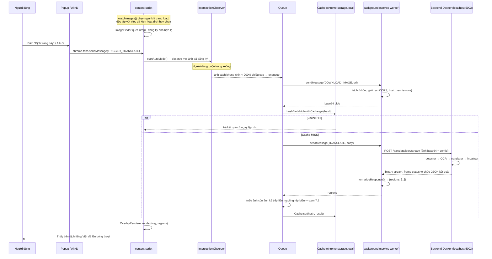
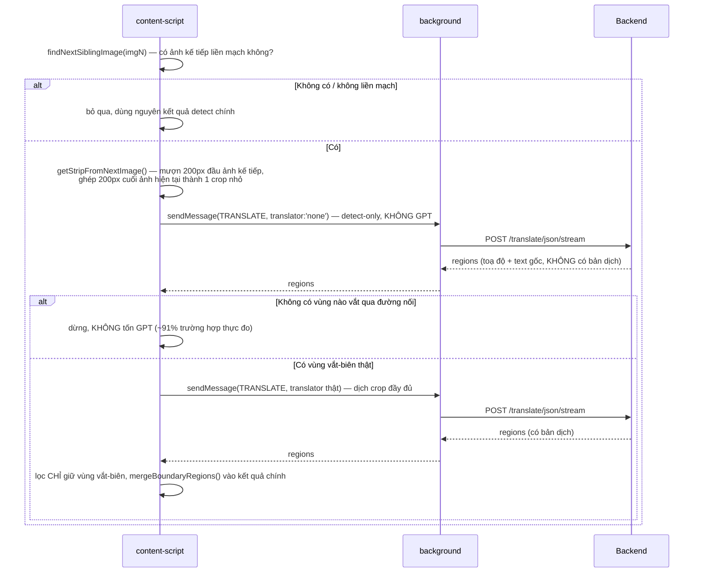

# Manga Overlay Translator — Tài liệu tổng quan

> Tài liệu này giải thích **toàn bộ dự án** từ đầu đến cuối: mục tiêu, kiến trúc, từng khái niệm nền tảng (kể cả nhỏ nhất), toàn bộ luồng dữ liệu, và lý do đằng sau từng quyết định kỹ thuật. Đọc file này là đủ để hiểu dự án mà không cần đọc lại lịch sử chat.
>
> **Cập nhật 2026-08-13:** viết lại toàn bộ để phản ánh đúng **extension** (kiến trúc chính thức từ 2026-07-22) — bản trước đó vẫn mô tả userscript cũ (đã deprecated) dù extension đã tồn tại hơn 3 tuần. Với mỗi tính năng lớn, phần lý do/thiết kế chi tiết nằm ở file spec riêng trong `docs/superpowers/specs/` (liệt kê đầy đủ ở mục 11) — file này chỉ tóm tắt đủ để hiểu bức tranh chung, không lặp lại toàn bộ nội dung spec.
>
> Các tài liệu khác trong thư mục: `spec-manga-overlay-translator.md` (spec gốc, chỉ còn giá trị lịch sử — mô tả userscript) là bản đặc tả ban đầu; `README.md` là nhật ký kỹ thuật backend (API thật, bug đã vá, schema, endpoint); file này (`docs.md`) là bức tranh toàn cảnh phía **frontend** (extension) + kiến trúc tổng thể.

---

## Cài đặt

1. Mở `chrome://extensions/` (hoặc `edge://extensions/`), bật **Developer mode**.
2. Bấm **Load unpacked**, chọn thư mục `extension/` trong repo này.
3. Bấm icon extension trên toolbar (hoặc Alt+D) để bắt đầu dịch trang đang xem, Alt+T để bật/tắt so sánh gốc/dịch.
4. Backend Docker phải đang chạy trước (`.\run-backend.ps1` — xem `README.md` mục "Chạy backend").

**`manga-overlay-translator.user.js` (Tampermonkey) đã deprecated, giữ lại chỉ để tham khảo lịch sử** — xem mục 2.1 vì sao dự án bắt đầu bằng userscript rồi chuyển hẳn sang extension. **Nếu trước đây đã cài nó: tắt hoặc gỡ đi** trước khi dùng extension, nếu không cả 2 sẽ cùng tìm ảnh và dịch song song trên 1 trang, tạo 2 lớp overlay chồng nhau/dịch trùng.

---

## 1. Dự án này làm gì

**Mục tiêu:** đọc truyện tranh raw (tiếng Nhật/Hàn/Trung/Anh...) trên bất kỳ website nào, tự động dịch sang tiếng Việt và **vẽ đè bản dịch lên đúng vị trí bóng thoại**, ngay trong lúc cuộn trang đọc — không cần tải ảnh về, không cần dùng công cụ dịch riêng.

**Trong phạm vi:**
- Ảnh truyện là thẻ `` bất kỳ trên trang web (không giới hạn danh sách site)
- Cả manga dạng trang rời (Nhật) và webtoon dạng cuộn dài (Hàn)
- Backend chạy ở máy của chính mình (không dùng dịch vụ cloud trả phí)
- Chỉ phục vụ 1 người dùng (chính là người viết ra nó)

**Ngoài phạm vi (cố tình không làm):** desktop app, đọc file local (CBZ/PDF), tài khoản/thanh toán, deploy backend lên internet, đa ngôn ngữ đích khác ngoài tiếng Việt (dù popup có cho chọn ENG/CHS/CHT/JPN/KOR làm đích, prompt La-tinh-hóa/ngôi xưng tùy biến chỉ đầu tư cho VIN — xem mục 5.1).

**Hai nguyên tắc kiến trúc cốt lõi** (mọi quyết định sau này đều xoay quanh 2 điều này — không đổi từ ngày đầu, kể cả sau khi port sang extension):

1. **Chỉ có 1 module duy nhất biết "hình dạng" dữ liệu backend trả về** (`ApiAdapter` trong `content.js`, cộng `normalizeResponse()` trong `background.js` — xem mục 4 vì sao có 2 lớp). Phần còn lại của extension chỉ làm việc với 1 cấu trúc dữ liệu nội bộ đã chuẩn hóa (`{ regions: [{x, y, w, h, src, dst, background}] }`). Nếu backend đổi cách trả dữ liệu, chỉ cần sửa đúng 1-2 chỗ.
2. **Backend không vẽ chữ lên ảnh. Trình duyệt tự vẽ bằng CSS/HTML.** Backend chỉ có nhiệm vụ: tìm bóng thoại ở đâu (tọa độ) + dịch chữ trong đó là gì (text). Việc "dán" chữ dịch lên đúng vị trí, chọn font, canh giữa, tự co giãn cỡ chữ... là việc của trình duyệt (`OverlayRenderer`). Điều này giúp: không phụ thuộc font tiếng Việt của backend, không cần bật tính năng "vẽ lại ảnh" nặng nề của backend cho phần chữ, và **chữ dịch vẫn bôi đen/copy được** như chữ thường trên web.

---

## 2. Các khái niệm nền tảng cần biết trước

Phần này giải thích từng khái niệm/công nghệ xuất hiện trong dự án, kể cả những cái tưởng "hiển nhiên", vì các phần sau sẽ dùng lại chúng liên tục.

### 2.1 Userscript, extension, và vì sao dự án bắt đầu bằng cái này rồi chuyển sang cái kia

Một **extension** (tiện ích mở rộng trình duyệt) là 1 gói phần mềm hoàn chỉnh: có `manifest.json` khai báo quyền hạn, có "background script"/service worker chạy ngầm, và phải cài qua "Load unpacked" (dev) hoặc Chrome Web Store.

Một **userscript** đơn giản hơn nhiều: 1 file JavaScript duy nhất (`.user.js`), chạy qua trình quản lý userscript (Tampermonkey), không cần build/đóng gói.

**Dự án bắt đầu bằng userscript (Giai đoạn C, 2026-07-19 trở về trước) vì lý do CORS/mixed-content** (xem 2.3): Tampermonkey cấp `GM_xmlhttpRequest`, bỏ qua hoàn toàn giới hạn CORS/HTTPS→HTTP mà JS thường của trang bị chặn — lúc đó có vẻ extension (Manifest V3 hiện đại) sẽ bị chính sách bảo mật mới chặn việc gọi tuỳ ý tới `localhost` từ context trang.

**2026-07-21: chuyển hẳn sang extension** sau khi xác nhận giả định trên **sai một nửa**: đúng là *content-script* (chạy trong context của trang) vẫn bị CORS/mixed-content y hệt JS thường, **nhưng** **`background` service worker** (chạy trong context riêng của chính extension, không phải context trang) **có thể fetch tự do tới bất kỳ origin nào đã khai báo trong `host_permissions`** — kể cả HTTP từ context nền tảng HTTPS — mà không bị CORS/mixed-content chặn. Vậy chỉ cần chuyển toàn bộ việc gọi mạng (tới backend VÀ tới CDN ảnh của site truyện) sang `background.js`, để `content-script` chỉ nhắn tin nội bộ (`chrome.runtime.sendMessage`) xin nó làm hộ — không có gì bị chặn cả (xem mục 4). Lý do đổi hẳn từ userscript deprecated hẳn: extension không cần cài Tampermonkey trung gian, có UI cài đặt (popup) là công dân hạng nhất của trình duyệt thay vì phải "giả lập" bằng `GM_*`, và không còn giới hạn "1 file duy nhất" (dễ tách module `content-script`/`background`/`popup` rõ ràng).

Đầy đủ lý do + kế hoạch port: `docs/superpowers/specs/2026-07-21-browser-extension-port-design.md`.

### 2.2 Tampermonkey `GM_*` API cũ → tương đương bên extension

Bảng đối chiếu (chỉ để hiểu userscript cũ nếu cần đọc lại nó — extension **không dùng** bất kỳ `GM_*` nào):

| Userscript cũ (`GM_*`) | Extension tương đương | Ghi chú |
|---|---|---|
| `GM_xmlhttpRequest` | `fetch()` trong `background.js` (context đặc quyền, có `host_permissions`) | Xem 2.1/2.3 |
| `GM_setValue`/`GM_getValue` | `chrome.storage.local` | Bất đồng bộ (`await`), không đồng bộ như `GM_*` |
| `GM_addStyle` | `document.createElement('style')` + `textContent` trong `content.js` | Tự chèn, không cần API riêng |
| `GM_registerMenuCommand` | `manifest.json` → `action.default_popup` (popup HTML riêng) + hotkey | Popup là bề mặt UI hạng nhất của trình duyệt — mạnh hơn cả menu Tampermonkey (xem mục 6 vì sao điều này quan trọng) |
| `@connect <domain>` | `host_permissions: ["<all_urls>"]` trong `manifest.json` | Khai báo 1 lần, áp dụng cho `background.js` |
| `@run-at` | `content_scripts[].run_at` trong `manifest.json` (hiện `document_idle`) | Xem mục 6.9 vì sao giá trị này quan trọng |

### 2.3 CORS, "mixed content", và vì sao content-script vẫn phải nhờ background

- **CORS** (Cross-Origin Resource Sharing) là cơ chế trình duyệt chặn 1 trang web (A) tự ý đọc dữ liệu từ 1 domain khác (B) bằng JavaScript, trừ khi B cho phép rõ ràng qua header đặc biệt.
- **Mixed content** là khi 1 trang tải qua **HTTPS** (an toàn) lại cố gọi tài nguyên qua **HTTP** thường — trình duyệt chặn để tránh kẻ tấn công chèn nội dung giả vào giữa đường truyền. Backend chạy ở `http://127.0.0.1:5003` (HTTP), hầu hết site đọc truyện dùng HTTPS.
- **Vì sao `content-script` (dù thuộc về extension) vẫn không thoát được 2 giới hạn này:** content-script được trình duyệt tiêm **vào chính document của trang**, chạy trong "isolated world" (biến/hàm riêng, không đụng JS của trang) nhưng **cùng 1 network/security context** với trang — nên `fetch()` gọi trực tiếp từ content-script vẫn bị CORS/mixed-content y hệt JS thường của trang.
- **Giải pháp (khác hẳn userscript):** `background.js` (service worker) chạy trong context **riêng của extension**, có quyền `host_permissions: ["<all_urls>"]` khai báo trong `manifest.json` — fetch từ đây không bị CORS/mixed-content chặn với **bất kỳ origin nào** đã khai báo. `content-script` gửi `chrome.runtime.sendMessage({type: 'TRANSLATE', ...})`, `background.js` mới thực sự `fetch()` tới backend/CDN ảnh, trả kết quả lại qua `sendResponse()`. Đây là lý do kiến trúc 3-mảnh ở mục 4.

### 2.4 Tainted canvas (canvas bị "nhiễm bẩn")

`<canvas>` cho phép vẽ đồ hoạ bằng JavaScript và đọc lại pixel (`getImageData()`/`toBlob()`/`toDataURL()`). Nhưng nếu vẽ lên canvas 1 ảnh tải từ **domain khác** (cross-origin) không qua CORS hợp lệ, trình duyệt đánh dấu canvas đó **"tainted"** — mọi thao tác đọc lại pixel sau đó ném `SecurityError`, để tránh 1 trang dùng `<canvas>` làm "cửa hậu" đọc trộm ảnh riêng tư của site khác.

Ảnh truyện gần như luôn nằm ở CDN khác domain → nếu vẽ trực tiếp từ `` của trang lên `<canvas>` thì canvas bị tainted. Dự án né bằng cách **luôn tải ảnh về dưới dạng `Blob`** (dữ liệu nhị phân thô, không mang "quốc tịch" domain nào) qua `background.js` (message `DOWNLOAD_IMAGE`) trước, rồi mới vẽ `Blob` đó lên canvas.

**Trường hợp đặc biệt — ảnh `blob:`/`data:` URL:** một số site (thường chống scrape) không đặt `src` là URL CDN thật, mà tự tải ảnh bằng JS của họ rồi tạo `blob:` URL cục bộ (`URL.createObjectURL()`) — và **thu hồi ngay sau khi giải mã xong** (`URL.revokeObjectURL()`). Gặp trường hợp này, tải lại `src` đó qua `background.js` **luôn thất bại** (dữ liệu không còn tồn tại) — không liên quan CORS. Nhưng vì `blob:`/`data:` URL được coi là **cùng gốc (same-origin)** với trang đã tạo ra nó, `drawImage()` **trực tiếp từ chính thẻ `` đang hiển thị** (đọc pixel đã giải mã sẵn trong bộ nhớ, không tải lại qua mạng) **không** làm canvas bị tainted. `ApiAdapter.downloadImageBlob()` (content.js:373) tự rẽ nhánh: `src` bắt đầu bằng `blob:`/`data:` → `imageElementToBlob(img)` (đọc trực tiếp qua canvas); ngược lại → nhờ `background.js` tải hộ.

### 2.5 Docker và vì sao backend chạy trong container

**Docker** đóng gói 1 chương trình cùng toàn bộ môi trường nó cần thành 1 "container" chạy độc lập. Backend `manga-image-translator` (mã nguồn mở, xem mục 3) phân phối sẵn dưới dạng Docker image, nên chỉ cần `docker run` là có ngay môi trường Python + PyTorch + model AI đã cài đúng, không cần tự cài thủ công.

**GPU passthrough:** cờ `--gpus all` khi `docker run` yêu cầu Docker chia sẻ GPU thật vào container — bắt buộc để chạy AI nhanh (CPU chậm hơn 10–20 lần).

**WSL2:** trên Windows, Docker Desktop chạy container bên trong 1 máy ảo Linux nhẹ (WSL2) — lý do lệnh Docker hay dùng cú pháp bash.

**VRAM vs "shared memory":** GPU laptop dùng trong dự án có 4GB VRAM chuyên dụng. Task Manager hiển thị số lớn hơn (~12GB) vì cộng thêm RAM hệ thống GPU "mượn tạm" — nhưng PyTorch **không dùng được phần mượn** để tính toán, chỉ dùng đúng 4GB thật (`nvidia-smi` mới cho số đúng).

### 2.6 Pipeline dịch ảnh — OCR, detection, inpainting, translation nghĩa là gì

Backend xử lý 1 ảnh qua 1 chuỗi bước AI nối tiếp:

1. **Detector (dò vùng chữ)** — quét ảnh, tìm bounding box (bbox) có khả năng chứa chữ. KHÔNG đọc được nội dung, chỉ trả toạ độ.
2. **OCR (Optical Character Recognition)** — với mỗi bbox, đọc pixel và chuyển thành text thật. Bước duy nhất "hiểu" ký tự gốc.
3. **Translator (dịch)** — dịch text gốc sang ngôn ngữ đích (gọi 1 LLM — ChatGPT/Gemini/DeepL qua API).
4. **Inpainter (tuỳ chọn — xóa chữ gốc)** — "vẽ lại" vùng chứa chữ gốc sao cho như chưa từng có chữ (image inpainting).
5. **Renderer (tuỳ chọn — vẽ chữ mới lên ảnh)** — dự án **luôn tắt** (`renderer: "none"`, xem Nguyên tắc #2 ở mục 1).

Dự án luôn dùng bước 1–3, bật bước 4 để lấy ảnh nền đã xoá chữ, luôn tắt bước 5.

**Biến thể "detect-only" (mới, 2026-08-13 — dùng cho gate của boundary-stitch, xem mục 5.7):** đặt `translator.translator = "none"` chạy đúng bước 1–2 (detect + OCR) rồi **dừng lại** — trả về toạ độ bbox + text gốc (`text.src`), **không dịch** (`text.dst` rỗng), **không gọi GPT**, **không inpaint**. Rất rẻ (chỉ model local). Dùng khi chỉ cần biết "ở đây có chữ không / chữ gì" mà chưa cần bản dịch thật.

### 2.7 CSS overlay: `position: absolute`, tọa độ theo %, `pointer-events`

Kỹ thuật vẽ chữ dịch đè lên ảnh, **không sửa gì trên chính thẻ ``** (kể cả DOM lẫn CSS — xem lý do quan trọng ở mục 6.10):

- Tạo 1 `<div class="mot-layer" style="position: absolute">`, gắn **trực tiếp vào `document.body`** (không bọc/không di chuyển ``), rồi tự tính đúng `left/top/width/height` (px) khớp vị trí/kích thước hiển thị thật của `` bằng `img.getBoundingClientRect()` (toạ độ viewport) cộng `window.scrollX/scrollY` (quy về toạ độ trang).
- Mỗi vùng chữ là 1 `<div>` con định vị bằng **phần trăm** (`left: (x/naturalWidth*100)%`) — tự "co giãn" theo layer cha khi zoom/resize, nhờ `ResizeObserver` + listener `window resize` gọi lại việc tính toạ độ layer, không cần tính lại từng vùng chữ.
- **`pointer-events: none`** trên layer cha (không chặn click/scroll xuyên qua tới trang bên dưới), nhưng **`pointer-events: auto`** riêng trên từng khung chữ (vẫn bấm được để xem chữ gốc).

### 2.8 [LỊCH SỬ — chỉ áp dụng cho nút nổi của userscript cũ, KHÔNG áp dụng cho popup của extension] Popover API, "top layer", capture-phase, `@run-at document-start`

Các khái niệm chỉ xuất hiện trong "cuộc điều tra" chống quảng cáo che nút (mục 6, toàn bộ mục đó là lịch sử userscript) — extension **không gặp lớp vấn đề này** vì popup (`action.default_popup`) là bề mặt UI riêng của trình duyệt, nằm hoàn toàn ngoài DOM/tầm với của trang từ đầu, không cần "leo thang" qua Popover/top-layer/capture-phase như nút nổi từng phải làm. Giữ lại đây để hiểu mục 6 và phòng khi có tính năng floating-UI trong-trang nào đó cần làm trong tương lai:

- **`z-index`** — quyết định phần tử nào "nằm trên" khi chồng lấp. `2147483647` là giá trị lớn nhất (giới hạn số nguyên 32-bit có dấu).
- **Top layer** — cơ chế hiển thị đặc biệt nằm "trên" toàn bộ cây DOM thường, bất kể `z-index`. **Popover API** (`popover="manual"` + `element.showPopover()`) cho phép đưa 1 phần tử vào đây.
- **Capture phase** — sự kiện đi qua 2 giai đoạn: **capture** (từ `document` xuống dần tới đích) rồi **bubble** (ngược lên). `addEventListener(fn, true)` chạy ở capture — tức chạy **trước**.
- **`@run-at document-start`** — script chạy **trước khi** trình duyệt parse HTML trang, trước cả `<script>` của chính trang.

---

## 3. Backend mã nguồn mở: `manga-image-translator`

Dự án dùng lại 100% phần AI (detect/OCR/dịch/inpaint) từ 1 dự án mã nguồn mở có sẵn: **[`manga-image-translator`](https://github.com/zyddnys/manga-image-translator)** (tác giả: zyddnys), chạy dưới dạng server REST cục bộ qua Docker image `zyddnys/manga-image-translator:main`.

Vì README chính thức của dự án này **không có tài liệu API rõ ràng**, toàn bộ hợp đồng API phải **dò bằng thực nghiệm** — các file `fixtures/*.json` là bằng chứng/nguồn tham chiếu.

### 3.1 Cách backend chạy trong dự án này

Container build từ 1 image tùy biến (`Dockerfile`), vá + mở rộng bằng các file trong `patches/` (chi tiết từng patch: `README.md` mục "File trong thư mục này"):

```dockerfile
FROM zyddnys/manga-image-translator:main
COPY patches/to_json.py /app/server/to_json.py
COPY patches/gpt_config-vi.yaml /app/gpt_config-vi.yaml
COPY patches/main.py /app/server/main.py            # full-override: thêm /fetch-image, thu hẹp CORS,
                                                       # đăng ký codec AVIF cho Pillow
COPY patches/share.py /app/manga_translator/mode/share.py            # relay optimization
COPY patches/sent_data_internal.py /app/server/sent_data_internal.py # buffer O(n)
COPY patches/deepl.py ...                                            # engine DeepL + VIN
```

Build 1 lần (hoặc sau khi sửa `patches/*`): `docker build -t manga-translator-patched:local .`, chạy bằng `run-backend.ps1` (đọc `.env`). **`docker restart` KHÔNG áp dụng image mới build** — phải `docker stop` (container tự xoá, `run-backend.ps1` dùng `--rm`) rồi chạy lại `run-backend.ps1` để thực sự dùng image mới.

### 3.2 Các bug thật của backend đã tìm ra + vá (và 1 landmine tự gây ra, đã vá)

1. **`POST /translate/json` (không stream) → crash HTTP 500.** FastAPI không áp dụng đúng bộ mã hoá tuỳ biến cho field `background` (`numpy.ndarray`). **Né:** dùng `/translate/json/stream`.
2. **Bản dịch bị thiếu trong JSON trả về.** `to_translation()` gốc đọc từ `ctx.translations` (dict luôn rỗng) thay vì `text_region.translation`. **Vá:** `patches/to_json.py`.
3. **`gpt_config` chỉ nhận đường dẫn file, không nhận nội dung YAML trực tiếp.** `OmegaConf.load(self.gpt_config)` coi nó luôn là đường dẫn. **Cách làm đúng:** đóng gói `patches/gpt_config-vi.yaml` vào image, truyền path.
4. **Prompt tùy chỉnh làm hỏng việc tách kết quả dịch nhiều dòng** — lỗi tự gây ra khi viết `gpt_config-vi.yaml` đầu tiên (bỏ sót chỉ dẫn giữ marker `<|N|>`). Đã vá (thêm lại chỉ dẫn + ví dụ mẫu).
5. **[LỊCH SỬ — code đã gỡ 2026-08-22, nhưng BÀI HỌC vẫn áp dụng] LANDMINE tự gây ra (2026-08-13, Feature B): nội dung tiêm động vào prompt phải brace-escape.** `chat_system_template` được backend chạy qua Python `str.format(to_lang=...)` — bất kỳ ký tự `{`/`}` literal nào trong nội dung tiêm vào (hồ sơ nhân vật do GPT tự sinh, cửa sổ hội thoại gần nhất từ OCR thật) sẽ ném `KeyError`/`ValueError`, và vì khối bị lỗi được LƯU LẠI vào file yaml riêng của truyện, nó **brick mọi lượt dịch tiếp theo của đúng truyện đó** cho tới khi bị ghi đè. **Vá:** `_esc_braces()` (`{`→`{{`, `}`→`}}`) áp dụng **chỉ** cho nội dung tiêm động, không bao giờ áp dụng cho `{to_lang}` thật của template — khi đó nằm ở `patches/main.py` hàm `_write_series_gpt_config` (nay không còn). **Bài học cho bất kỳ code tiêm nội dung động vào prompt sau này: luôn brace-escape trước khi ghép.**

Chi tiết đầy đủ từng bug (log lỗi thật, số liệu đo được): `README.md` mục "Bug đã tìm ra + vá".

### 3.3 Giao thức stream — vì sao không phải JSON thuần

`/translate/json/stream` trả về 1 **luồng nhị phân** gồm nhiều "khung" (frame) nối tiếp:

```
[1 byte: status][4 byte: độ dài payload, big-endian][N byte: payload]
```
- `status = 0`: khung cuối, `payload` là JSON UTF-8 kết quả thật.
- `status = 2`: lỗi, `payload` là text mô tả lỗi.
- `status = 1/3/4`: khung tiến độ trung gian — chỉ log, không xử lý gì thêm.

`background.js`'s `normalizeResponse()` (dòng ~82) đọc "thô" bằng `DataView`/`ArrayBuffer` (`getUint32(offset, false)` — `false` = big-endian) thay vì `response.json()`.

### 3.4 Schema request/response cuối cùng (đã xác nhận thật)

**Request:**
```json
{
  "image": "data:image/png;base64,...",
  "config": {
    "detector": { "detection_size": 2400 },
    "translator": { "translator": "chatgpt", "target_lang": "VIN", "gpt_config": "/app/gpt_config-vi.yaml" },
    "render": { "renderer": "none" },
    "inpainter": { "inpainter": "lama_mpe", "inpainting_size": 1024 }
  }
}
```

**Response** (khung `status=0`, đã tính mọi bug đã vá):
```jsonc
{
  "translations": [
    {
      "minX": 459, "minY": 44, "maxX": 474, "maxY": 306, // bbox px TUYỆT ĐỐI
      "text": { "src": "chữ gốc...", "dst": "chữ đã dịch..." }, // dst RỖNG nếu translator="none" (detect-only, mục 2.6)
      "background": "data:image/png;base64,..." // ảnh ĐÃ INPAINT, đúng khít bbox — chỉ có ý nghĩa khi inpainter bật (bị bỏ qua nếu detect-only)
      // ...is_bulleted_list, angle, prob, text_color — không dùng tới
    }
  ]
}
```

Không có field `vertical` (hướng chữ dọc/ngang) trong response thật — toàn bộ thiết kế `OverlayRenderer._reshapeForHorizontalText` không dựa vào field đó (mục 5.6).

**Endpoint mở rộng riêng của bản patch (không có ở backend gốc):**
- `POST /fetch-image` — relay tải ảnh kèm `Referer` đúng (dùng khi cả fetch thẳng từ `background.js` lẫn không có Referer đều bị site chặn hotlink — mục 4).
*(`/build-series-context`, `/set-series-context`, `/set-recent-dialogue` từng tồn tại cho tính năng ngữ cảnh nhân vật — đã gỡ bỏ cùng tính năng đó ngày 2026-08-22, xem mục 5.9.)*

---

## 4. Kiến trúc tổng thể

```
┌──────────────────────────────── Trình duyệt (Chrome/Edge) ─────────────────────────────────┐
│                                                                                                │
│  Trang web bất kỳ (HTTPS)                    Popup (action.default_popup, popup.html/js)     │
│                  - Nút "Dịch trang này" → TRIGGER_TRANSLATE     │
│                                                 - backend URL, ngôn ngữ đích, engine, eager,   │
│  content-script (content.js, ~2000 dòng)         ngữ cảnh nhân vật (chrome.storage.local)      │
│  chạy TRONG context trang (isolated world)     - Xoá cache dịch                                │
│    ImageFinder / watchImages / Queue                        │ chrome.tabs.sendMessage          │
│    Cache (chrome.storage.local)                              ▼                                 │
│    ApiAdapter — ĐÓNG GÓI request, KHÔNG tự fetch                                              │
│    OverlayRenderer — vẽ <div> đè lên  bằng CSS                                            │
│    findNextSiblingImage / detectBoundaryRegions — ghép biên webtoon                            │
│          │ chrome.runtime.sendMessage (TRANSLATE / DOWNLOAD_IMAGE / BUILD_SERIES_CONTEXT/...)  │
│          ▼                                                                                     │
│  background (service worker, background.js) — context RIÊNG của extension                     │
│    NƠI DUY NHẤT thực sự fetch() ra ngoài — host_permissions bỏ qua CORS/mixed-content           │
│    normalizeResponse() — hiểu giao thức binary stream + schema JSON thật                       │
└───────────────────────────────────────────┬────────────────────────────────────────────────────┘
                                             │ HTTP POST (background.js → backend, không giới hạn CORS)
                                             ▼
┌──────────────────── Docker container (localhost:5003, xem mục 3) ────────────────────┐
│  manga-image-translator (mã nguồn mở, đã patch — mục 3.2) + endpoint mở rộng riêng    │
│    detector → OCR → translator (ChatGPT/Gemini/DeepL qua API ngoài) → inpainter       │
│    trả JSON (qua binary stream): bbox + text gốc + text dịch + ảnh nền đã inpaint     │
└──────────────────────────────────────────────────────────────────────────────────────┘
```

**Vì sao 3 mảnh (content-script/background/popup) thay vì 1 file:** mỗi mảnh chạy trong 1 **context bảo mật khác nhau** của trình duyệt — đây không phải chọn lựa kiến trúc tuỳ ý mà là **bắt buộc** bởi chính sách Manifest V3 (mục 2.3). `content-script` là nơi duy nhất đọc/ghi được DOM của trang thật; `background` là nơi duy nhất fetch tự do; `popup` là nơi duy nhất có UI cài đặt lâu dài (đóng khi mất focus, không giữ state — mọi setting phải qua `chrome.storage.local`, không giữ biến JS). 3 mảnh giao tiếp thuần bằng `chrome.runtime.sendMessage`/`chrome.tabs.sendMessage` — **không** chia sẻ biến JS trực tiếp.

**Gotcha đã gặp thật khi port (không lộ ra qua code review, chỉ lộ khi chạy thật):**
1. `chrome.runtime.sendMessage`/`sendResponse` **không** bảo toàn `ArrayBuffer` qua message channel như `window.postMessage` — nó về tới đầu kia dưới dạng `Object` đã bị "tước" mất kiểu nhị phân. Mọi dữ liệu nhị phân (bytes ảnh tải về) phải chuyển sang chuỗi **base64** trước khi gửi (`arrayBufferToBase64`/`base64ToBlob`).
2. Manifest V3 content-script/background **không tự đặt được header `Referer`** khi fetch (khác `GM_xmlhttpRequest` cũ có đặc quyền này) — ảnh bị site chặn hotlink (thiếu `Referer` đúng) được xử lý bằng cách relay qua backend (`POST /fetch-image`, `patches/main.py`), dùng client HTTP Python thật (không giới hạn header) để tải kèm `Referer` đúng.
3. Bất kỳ `chrome.runtime.onMessage` listener nào **có thể** bị gọi kèm callback (`sendMessage(msg, cb)`) phải gọi `sendResponse(...)` **đồng bộ** (hoặc `return true` rồi gọi sau) dù logic bên trong không cần trả gì — thiếu nó Chrome báo `"The message port closed before a response was received"` cho bên gọi, dù listener chạy thành công. Bug này ẩn hàng tháng (không ai gọi kèm callback) tới khi `popup.js` là caller đầu tiên dùng callback.
4. Ảnh trên site có ancestor CSS thiết lập stacking context riêng (`z-index` khác `auto`) có thể **che khuất `.mot-layer`** dù nó gắn thẳng vào `document.body` — `z-index: auto` (mặc định) của layer thua bất kỳ `z-index` cụ thể nào của ancestor site, bất kể thứ tự DOM. Vá: `.mot-layer { z-index: 2147483647 }` trong `<style>` tiêm vào trang.

---

## 5. Đi qua từng module (theo đúng thứ tự dữ liệu chảy qua)

Dòng tham chiếu dưới đây là của `extension/content-script/content.js` (1971 dòng) trừ khi ghi rõ file khác.

### 5.1 `CFG` — toàn bộ tham số cấu hình (content.js:4)

Không có giao diện chỉnh từng hằng số này (chỉ 1 nhóm setting hay đổi mới lên popup — backend URL, ngôn ngữ đích, engine, eager, xoá cache, xem popup.js) — sửa số trực tiếp trong code cho phần còn lại vẫn nhanh hơn xây UI cho mọi tham số. Các giá trị đáng chú ý nhất hiện tại:

| Tham số | Giá trị hiện tại | Vì sao |
|---|---|---|
| `DETECTION_SIZE` | `2400` | Điểm ngọt duy nhất bắt ổn định cả chữ nhỏ (~2048 mới bắt được) lẫn chữ to/đậm (sót ở 1536-2048, bắt lại ở 1024/3072) — đo thực nghiệm, không đơn điệu theo kích thước. **Detection còn NONDETERMINISTIC run-to-run** (biến thiên tăng theo `detection_size`) — xem mục 8, chưa có fix triệt để |
| `CACHE_VERSION` | `24` | Tăng mỗi khi đổi tham số gửi backend (hoặc đổi hành vi ảnh hưởng kết quả cache) — cache cũ tự bị bỏ qua, không cần người dùng tự xoá Storage |
| `INPAINTER` / `INPAINTING_SIZE` | `lama_mpe` / `1024` | Test thật (render trên trang) không thấy `lama_large` khá hơn rõ rệt — `lama_mpe` nhẹ hơn, an toàn VRAM hơn (~3.4GB vs ~3.7GB/4GB) |
| `BUSY_STD_THRESHOLD` | `25` | Ngưỡng độ lệch chuẩn độ sáng trên `r.background` (ảnh ĐÃ inpaint) để quyết định bỏ lớp nền inpaint mờ, chỉ còn chữ viền trắng (mục 5.6) |
| `TILE_MAX_H` / `TILE_OVERLAP` | `4000` / `200` | Webtoon dài cắt lát (mục 5.5) — 4000 chừa biên an toàn dưới giới hạn canvas trình duyệt (~16384px, còn giới hạn *tổng diện tích* riêng) |
| `BOUNDARY_BORROW_HEIGHT` | `200` | Ghép biên webtoon (mục 5.7) — bong bóng bị cắt nằm NGAY tại đường nối, đo thực nghiệm 500/300/200/150px bắt straddle y hệt nhau, 200 giảm ~60% vùng bị re-detect/re-OCR dư thừa |
| `BOUNDARY_CONTIGUITY_TOL` | `50` (px) | Chỉ ghép biên khi ảnh kế tiếp nối liền theo chiều dọc (khoảng hở ≤ ngưỡng) — tránh ghép nhầm dải ảnh trang khác trên reader chuyển-trang |
| `CONCURRENCY` | `1` | Đã xác nhận thực nghiệm backend xử lý tuần tự (1 GPU, 1 instance) — tăng song song phía client không có lợi |
| `PREFETCH_MARGIN` | `'200% 0px'` | `IntersectionObserver` bắt đầu dịch khi ảnh còn cách khung nhìn 2 lần chiều cao màn hình |
| `FONT_DEFAULT` | `16` (không phải `FONT_MAX`) | Ép trần, chỉ **giảm** khi khung chật — toàn trang đồng nhất 1 cỡ chữ thay vì "phồng" khác nhau tuỳ khung |

### 5.2 `ImageFinder` — tìm đúng `` là ảnh truyện (content.js:106)

Chạy trên **mọi trang web** (`content_scripts.matches: ["<all_urls>"]`), tự đoán "ảnh nào có khả năng là ảnh truyện" bằng 1 chuỗi điều kiện, không phụ thuộc danh sách site:

1. Không phải placeholder lazy-load (`src` không phải `data:` URI)
2. Đủ lớn thật (`naturalWidth/Height` ≥ 400×400px)
3. Đang hiển thị to trên trang (`clientWidth / window.innerWidth ≥ 0.3`)
4. Không nằm trong `<header>/<nav>/<footer>/<aside>`
5. class/id không chứa từ khoá gợi ý quảng cáo/logo/avatar
6. Tỉ lệ cao/rộng trong `[0.5, 100]` (chặn trên rất rộng để không loại webtoon cực dài)

**Bẫy lazy-load:** nhiều site đặt `src` tạm là ảnh giả (SVG "shimmer" khớp kích thước ảnh thật) rồi thay `src` thật khi cuộn tới — điều kiện 1 (loại `data:` URI) chặn đúng trường hợp này.

### 5.3 `Cache` — không dịch lại ảnh đã dịch (content.js:139)

Key chính là **hash SHA-256 của chính bytes ảnh** (`crypto.subtle.digest`, fallback FNV-1a nếu `crypto.subtle` không tồn tại — trang HTTP thường, ngoài "secure context"), **không phải URL ảnh** (CDN hay đổi URL mỗi lần tải trang). Key ghép thêm `engine`/`targetLang`/`CACHE_VERSION`.

**URL→hash fastpath (2026-08-03):** `Cache.getHashByUrl(url)`/`setUrlHash(url, hash)` — tra theo `img.src` TRƯỚC, bỏ qua việc tải+băm lại ảnh (~3.4s) nếu URL này đã được dịch từ trước (đọc/prefetch trước đó) — trang cache-hit render trong ~15ms thay vì ~3.4s.

### 5.4 Hạ tầng chung — blob/base64/message helpers (content.js:190-372)

`computeRegionComplexity`, `imageElementToBlob`, `reencodeToPng` (luôn ép ảnh tải về qua PNG trước khi gửi backend — Pillow phía backend không đọc được 1 số định dạng trình duyệt hiển thị OK, ví dụ AVIF), `base64ToBlob`, `sendMessageAsync` (wrap `chrome.runtime.sendMessage` thành Promise). Các hàm `getTargetLang`/`getTranslatorEngine`/`getCharacterContext`/`getEagerTranslate` đều **đọc `chrome.storage.local` mỗi lần gọi** (không cache vào biến cố định) để đổi setting trong popup có tác dụng ngay, không cần reload content-script.

### 5.5 `ApiAdapter` — đóng gói request, KHÔNG tự fetch (content.js:372)

Khác hẳn userscript cũ (nơi `ApiAdapter` tự `GM_xmlhttpRequest`), `ApiAdapter` giờ chỉ **đóng gói** đúng body request rồi nhờ `background.js` gửi hộ (mục 2.3/4):

- `downloadImageBlob(img)` — rẽ nhánh `blob:`/`data:` URL (đọc trực tiếp ``, mục 2.4) vs URL thường (nhờ `background.js` qua message `DOWNLOAD_IMAGE`, rồi uỷ cho `downloadBlobFromUrl()` — cũng chính là hàm prefetch dùng, để hai đường không thể tính ra hash lệch nhau).
- `translateImage(blob, detectOnly=false)` — dựng đúng `config` (detector/translator/render/inpainter theo `CFG`), gửi message `TRANSLATE`. `detectOnly=true` ép `translator:'none'` và `inpainter:'none'`, bỏ `gpt_config` khỏi request (mục 2.6) — dùng cho gate ghép-biên (mục 5.7).

  **Phải ghi rõ `inpainter:'none'`, không được bỏ trống khoá đó.** Bỏ trống thì backend dùng mặc định của nó là `lama_large`, *không* phải `CFG.INPAINTER`. Đo trên log một phiên webtoon thật (2026-08-26, 180 lượt gọi): 41 lượt chạy `[LamaLargeInpainter]` — đúng bằng số lượt probe — inpaint xong rồi vứt đi, tốn 10,3s GPU và dùng biến thể ngốn VRAM hơn (~3,7GB vs ~3,4GB) trên card 4GB. Sau khi sửa, cùng một ảnh cho ra **toạ độ y hệt**, nhanh hơn (1,09s vs 1,63s) và payload nhỏ hơn 2,5 lần.
- `translateImageTiled(blob, naturalW, naturalH, img)` — webtoon dài (mục 5.5.1).

**Gửi byte gốc thay vì luôn nén lại PNG (2026-08-26).** Trước đây mọi ảnh đều bị giải mã bằng trình duyệt rồi nén lại thành PNG trước khi gửi — đo trên ảnh mẫu của repo là phình 7,4× (117 KB webp → 871 KB data URL), cộng một lượt nén PNG ảnh 6 megapixel mỗi trang. Đã kiểm chứng trên chính image đang chạy: Pillow 10.2.0 đọc thẳng được JPEG/PNG/WebP, chỉ AVIF là không — nên Dockerfile cài thêm `pillow-avif-plugin` và `patches/main.py` `import pillow_avif`. `image-format.js` quyết định gửi thẳng hay nén lại. Ba cái bẫy phải xử lý cùng lúc, đừng gỡ cái nào ra khỏi cái nào:

1. **EXIF orientation.** Trình duyệt *áp dụng* hướng xoay EXIF khi vẽ ``, Pillow thì *không*. Đường cũ vẽ qua canvas nên hướng xoay đã "nướng" sẵn vào PNG; gửi thẳng byte gốc của ảnh có `Orientation != 1` sẽ khiến backend thấy ảnh chưa xoay và **toàn bộ overlay đặt sai chỗ**. Quy tắc: thấy bất kỳ dấu hiệu EXIF nào là nén lại, không cố đọc giá trị orientation — sai về phía an toàn.
2. **Backend cũ.** Người dùng có thể cập nhật extension mà chưa build lại image. `translateImage()` thử lại đúng một lần qua đường nén PNG khi backend từ chối blob gửi-thẳng.
3. **`createImageBitmap` không có codec AVIF** trên một số bản Chromium dù `` thì có (đúng bug Cốc Cốc v0.33). Từ nay blob tới các chỗ cắt/ghép có thể là AVIF, nên mọi lần giải mã đi qua `decodeBlobToBitmap()` — có đường lùi ``+canvas.

**Cửa sổ ngữ cảnh thoại — chỉ nguồn tiếng Anh (2026-08-26).** Mỗi lượt dịch mang theo tối đa 8 câu đã dịch gần nhất của chính tab đó (`extension/content-script/dialogue-context.js`), gửi trong khoá `context` của body request. Lý do: quy tắc "giữ nguyên cặp xưng hô" trong `gpt_config-vi.yaml` là **bất khả thi** khi mỗi trang là một lời gọi API không có trí nhớ — model không thể biết trang trước đã dùng cặp nào. Đây là lỗi cấu trúc, không phải lỗi diễn đạt prompt.

Đo được (3 lần chạy mỗi điều kiện, trên chuỗi trang thật có đủ bìa/credits/SFX): không ngữ cảnh → 5.3 lần đổi đại từ mỗi lượt đọc; cửa sổ **không lọc** → 2.0 lần nhưng chốt vào đại từ khác nhau giữa các lần chạy; cửa sổ **có lọc** → 1.0 lần và ra y hệt cả 3 lần. Chi phí +12% token prompt (so với 27–32% của bản đã gỡ). Thích ứng vẫn giữ: sang cảnh bạn bè ngang hàng nó vẫn đổi sang `cậu`.

Kiểm chứng đầu-cuối qua HTTP thật, cùng một ảnh chỉ khác trường `context`: có ngữ cảnh → "**Ông** không bảo quản thảo dược đúng cách"; không ngữ cảnh → "**BẠN** KHÔNG BẢO QUẢN...".

Ngữ cảnh giữ ở **client, theo từng tab** — không phải backend. Thí nghiệm tiêm ngữ cảnh từ truyện khác cho thấy đó là tai hoạ **âm thầm**: mọi thước đo nhất quán vẫn đẹp trong khi cả cảnh bị dịch sai register (tiệm thuốc hiện đại thành giọng cung đình `ta-ngươi`). Người dùng chạy tới 10 tab đồng thời nên state dùng chung ở backend là đúng kịch bản đó.

Chỉ tiếng Anh, vì tiếng Anh chỉ có một chữ "you" nên model buộc phải đoán; Nhật/Hàn mã hoá sẵn mức lịch sự trong câu gốc nên số đo trên không suy ra được — và suy diễn kiểu đó chính là thứ đã làm hỏng bản trước. Cổng chặn dùng lại `_srcNonLatin` sẵn có. Xem spec `2026-08-26-english-pronoun-context-window-design.md`.

**Chuẩn hoá chữ HOA/thường theo chữ gốc (2026-08-26).** `extension/content-script/text-case.js`: nguồn OCR gần như luôn ALL-CAPS (chữ truyện tranh), nên nếu chữ gốc là ALL-CAPS thì bản dịch cũng đưa lên HOA lúc hiển thị. Đo được vấn đề: 85% ALL-CAPS lẫn 15% viết thường **trong cùng một chương** — chính sự lẫn lộn mới chói mắt, không phải việc viết hoa. Cửa sổ ngữ cảnh còn khuếch đại nó (66% → 84% ngay sau khi bật).

Không nhờ LLM: `gpt_config-vi.yaml` đã có quy tắc chuẩn hoá viết hoa từ lâu mà model vẫn không tuân thủ ổn định — prompt là xu hướng, không phải bảo đảm.

Viết HOA là chiều an toàn **duy nhất**: cả nguồn lẫn đích đều ALL-CAPS nên máy không thể phân biệt tên riêng, sentence-case sẽ biến `ERKIN` giữa câu thành `erkin`. Đưa lên HOA thì không bao giờ làm hỏng tên riêng.

Chỉ đổi chuỗi **hiển thị** — `r.dst` và cache giữ nguyên văn model trả về, nên đổi ý sau này không phải bump `CACHE_VERSION`. Kèm theo: `_fitTextboxFont()` giờ đọc chữ thẳng từ DOM thay vì nhận qua tham số, vì chữ HOA **rộng hơn** — đo bằng chuỗi cũ sẽ ra cỡ chữ quá lớn và tràn khung.

### 5.5.1 Webtoon dài — cắt lát (content.js:477, `translateImageTiled`)

Ảnh cao hơn `TILE_MAX_H` (4000px, chừa biên an toàn dưới giới hạn canvas ~16384px + giới hạn *tổng diện tích* riêng của trình duyệt):

1. `sliceImageIntoTiles()` — cắt từ `Blob` đã tải (không phải `` của trang, tránh tainted canvas) thành nhiều lát chồng lấn `TILE_OVERLAP` (200px).
2. `translateImageTiled()` gọi backend **tuần tự** từng lát, cộng offset `y` của lát vào bbox trả về.
3. `dedupeRegions()` + `iou()` — 1 bóng thoại nằm trong vùng chồng mép bị dịch 2 lần (2 lát cạnh nhau) — `IoU > 0.5` coi là trùng, giữ bbox lớn hơn.
4. Lát **cuối cùng** thêm được ghép-biên riêng với ảnh KẾ TIẾP trên trang (mục 5.7) — độc lập với việc dedupe nội bộ giữa các lát.

Cache vẫn hoạt động xuyên suốt: hash tính trên Blob gốc chưa cắt, kết quả lưu là region đã ghép+dedupe xong — tiling vô hình với `Cache`.

**Chưa test với ảnh webtoon thật >10.000px** (kế thừa từ trước khi port sang extension — chưa có bằng chứng mới xác nhận lại trên bản extension).

### 5.6 `OverlayRenderer` — vẽ chữ dịch bằng CSS (content.js:644)

Module nhiều chi tiết tinh chỉnh nhất — render đẹp trên ảnh của site bất kỳ khó hơn tưởng tượng ban đầu.

**Vẽ theo 2 lớp (pass), không xen kẽ:** Pass 1 — lớp nền (`.mot-bg`, ảnh đã inpaint, khít bbox) cho vùng không "busy"; Pass 2 — lớp chữ (`.mot-textbox`), vẽ **sau cùng, toàn bộ**. Lý do tách: phần tử thêm vào DOM sau luôn nằm trên — nếu vẽ xen kẽ, lớp nền của vùng 2 (vẽ sau) có thể đè lên lớp chữ của vùng 1 (vẽ trước), hay gặp ở cột chữ dọc CJK sát nhau.

**`_computeSafeBounds()` (Feature A, 2026-08-13) — clamp reshape theo MIDPOINT giữa các vùng lân cận.** Text CJK gốc thường là cột dọc rất hẹp; bản dịch tiếng Việt luôn viết ngang (không có field `vertical` — mục 3.4). `_reshapeForHorizontalText()` "định hình lại" khung đặt chữ thành hình chữ nhật cân đối hơn, giữ nguyên diện tích gốc — nhưng nếu 2 vùng CJK dọc nằm sát nhau, reshape độc lập từng vùng có thể khiến 2 khung mới **chồng lên nhau**. `_computeSafeBounds()` tính điểm giữa (midpoint) giữa mép ĐỐI DIỆN GỐC của 2 vùng lân cận làm ranh giới chung, clamp reshape không bao giờ vượt qua ranh giới đó — đảm bảo 2 khung đã reshape không bao giờ va chạm. Chi tiết đầy đủ + review tìm ra bug (rule area-ratio ban đầu là no-op toán học vì reshape bảo toàn diện tích): `docs/superpowers/specs/2026-08-12-overlay-safe-layout-and-boundary-detection-design.md`.

**`_fitFontSize`/`_fitTextboxFont`** — binary search cỡ chữ lớn nhất vừa khít khung trong `[FONT_MIN=8, FONT_DEFAULT=16]`, đo bằng `CanvasRenderingContext2D.measureText()` (canvas ẩn, tránh layout thrashing).

**`computeRegionComplexity()`** — đo độ lệch chuẩn độ sáng trên `r.background` (ảnh ĐÃ inpaint, không phải ảnh gốc — ảnh gốc luôn chứa chính chữ cần dịch nên tương phản cao giả tạo, đã từng là 1 bug thật). Vượt `BUSY_STD_THRESHOLD=25` → bỏ hẳn lớp nền inpaint, chỉ còn chữ viền trắng dày đè trực tiếp lên tranh gốc (`.mot-busy`: nền trắng mờ + đổ bóng để tách bạch khỏi tranh nền).

**`imgLayers` (Map) + `positionLayer()`** — layer gắn thẳng vào `document.body` (KHÔNG bọc `` trong `<span>`, dù đây là cách làm ban đầu — bọc từng phá layout của 1 số site có viewer JS tự quản lý DOM chặt, mục 6.10), tính toạ độ qua `getBoundingClientRect()`, quan hệ ảnh↔layer lưu trong `Map`. `ResizeObserver` theo dõi ``, gọi lại `positionLayer()` + `_fitTextboxFont` khi kích thước hiển thị đổi (zoom/resize).

### 5.7 Ghép biên webtoon — bong bóng bị cắt ngang giữa 2 ảnh liền kề

**Vấn đề gốc:** webtoon dài được site chia thành nhiều file `` riêng biệt xếp chồng liên tục — 1 bong bóng thoại có thể nằm vắt ngang đúng đường nối giữa 2 file, khiến detector của mỗi ảnh riêng chỉ thấy 1 nửa (hoặc bỏ sót hẳn nếu nửa đó quá nhỏ).

**Cơ chế hiện tại (2026-08-13, đã qua 3 lần lặp trong cùng ngày — xem lịch sử dưới):**
1. `findNextSiblingImage(img)` (content.js:1021) — tìm ảnh kế tiếp theo vị trí Y tuyệt đối trên trang, **tự động gate**: bỏ qua ảnh ngang (`naturalHeight ≤ naturalWidth` — không phải webtoon strip), bỏ qua ảnh không liền mạch (khoảng hở > `BOUNDARY_CONTIGUITY_TOL=50px`).
2. `getStripFromNextImage()` mượn `BOUNDARY_BORROW_HEIGHT=200`px đầu ảnh kế tiếp, ghép với 200px cuối ảnh hiện tại thành 1 ảnh crop nhỏ RIÊNG BIỆT (không nối vào ảnh chính — làm vậy sẽ co hẹp độ phân giải detect của CẢ ảnh chính).
3. `detectBoundaryRegions()` (content.js:1082) — **detect-first**: chạy crop này với `translator:'none'` (mục 2.6, rẻ, không GPT) TRƯỚC; nếu **không** có vùng nào vắt qua đường nối (`r.y < ownStripH < r.y+r.h`) thì dừng ngay, không tốn GPT (đúng ~91% trường hợp thực đo). Chỉ khi có vùng vắt-biên thật mới gọi lại crop đó với `translator` thật (chatgpt/gemini/deepl) để lấy bản dịch, rồi lọc CHỈ giữ vùng vắt-biên (bỏ vùng nằm hẳn 1 phía — phía đó detect chính của ảnh tương ứng đã/sẽ tự bắt đủ).
4. `mergeBoundaryRegions()` (content.js:1237) — hợp nhất vùng vắt-biên vào kết quả detect chính bằng `overlapRatio` (giao/diện-tích-nhỏ-hơn, KHÔNG phải IoU chuẩn — 1 vùng ghép-biên đầy đủ và 1 vùng detect-lại-1-phần của ảnh chính rất chênh kích thước, IoU chuẩn sẽ đánh giá thấp dù 1 vùng nằm gọn trong vùng kia), giữ bản DÀI HƠN khi chồng lấp > 0.5.

**Lịch sử 3 lần lặp trong ngày 2026-08-13 (bài học, đừng lặp lại lần 2):**
- **Trước đó:** có 1 toggle bật/tắt thủ công trong popup, mặc định TẮT.
- **Lần 1 — hợp nhất:** bỏ toggle, luôn bật (tự gate bởi `findNextSiblingImage`).
- **Lần 2 — edge-gate (ĐÃ REVERT, đừng thử lại):** thử chỉ chạy crop khi detect CHÍNH của ảnh hiện tại có 1 vùng chạm mép dưới (tiết kiệm gọi crop). **Thất bại thật trên browser** (mất chữ "I SEE" + vài đoạn khác) — vì detect chính là **nondeterministic**, với bong bóng chỉ để lại 1 mẩu nhỏ ở mép dưới ảnh, có lần detect chính bắt được mẩu đó, có lần không — khi không, gate tắt luôn, bỏ mất CẢ bong bóng vắt-biên. **Bài học: không được gate dựa trên detect SLIVER (mẩu nhỏ) của ảnh chính — nondeterministic.**
- **Lần 3 — detect-first (hiện tại):** khác về bản chất với lần 2 — gate dựa trên detect NGUYÊN BONG BÓNG ĐÃ GHÉP trong chính crop (không phải sliver của ảnh chính), dùng CÙNG detector mà bước dịch thật cũng dùng để tìm vắt-biên → không thể tệ hơn always-run. Đã kiểm chứng thực nghiệm (12 seam thật + 15 ca vắt-biên tổng hợp cắt xuyên từng bong bóng đã biết + lặp lại 6 lần): 0 lần thua always-run, tiết kiệm ~91% lượt gọi GPT thừa.

**Đánh đổi còn giữ nguyên có chủ đích (2026-08-13, người dùng đã xem log backend và chọn giữ):**
- Vẫn có **1 lượt detect-only mỗi trang liền mạch** (bước 3, rẻ nhưng không miễn phí — thêm ~1 lượt detect+OCR local cho mỗi ảnh).
- Ở seam vắt-biên **thật** (hiếm — 0/146 seam đo được trên 1 chương thử nghiệm), bong bóng bị GPT dịch **2 lần** (1 lần một phần bởi ảnh chính, 1 lần đầy đủ bởi crop) — `mergeBoundaryRegions` dedupe đúng phần RENDER (đã verify: chỉ 1 vùng cuối cùng, không vẽ trùng), nhưng backend vẫn tốn công dịch thừa lần đó.
- Chưa browser-verify trên nội dung CJK (chỉ mới verify trên webtoon tiếng Anh) — cơ chế độc lập ngôn ngữ nên dự kiến vẫn đúng, nhưng chưa có bằng chứng thật.

Chi tiết đầy đủ + số liệu từng bước: `docs/superpowers/specs/2026-07-23-cross-image-boundary-stitching-design.md` (thiết kế gốc) và `2026-08-12-overlay-safe-layout-and-boundary-detection-design.md` (rearchitect tách crop riêng); tiến trình detect-first/borrow-200 chỉ có trong memory phiên làm việc + commit message (`git log` trên các commit boundary-stitch ngày 2026-08-13), chưa có file spec riêng vì thực hiện trực tiếp trên `main` sau khi test thực nghiệm thay vì qua chu trình brainstorm/spec đầy đủ.

**Registry dedup xuyên-ảnh (content.js:1186-1263):** `renderedPageBBoxes`/`isDuplicateOfRendered`/`registerRenderedRegion` — chỉ đăng ký vùng STRIP-ZONE (`r.y+r.h > naturalHeight`) để không dedup nhầm giữa 2 ảnh không liên quan trên reader chuyển-trang (bug đã vá 2026-08-03, gated cùng `BOUNDARY_CONTIGUITY_TOL`).

### 5.8 `translateAndRenderImage` — job chính (content.js:1396)

Chu trình xử lý 1 ảnh: tải blob → hash → tra `Cache` → (miss) gọi `ApiAdapter` (nhánh tile hay không) → ghép biên (mục 5.7, chỉ nhánh không-tile — nhánh tile tự ghép biên ở lát cuối) → `Cache.set` → `OverlayRenderer.render()` → cập nhật `state.done`/`state.errors`. Lỗi gộp vào `errorLog[]`, không crash trang.

### 5.9 Nhất quán ngôi xưng tiếng Việt — chỉ còn ở tầng prompt

**Vấn đề gốc:** mỗi ảnh được dịch **độc lập** (GPT không nhớ ảnh trước) → cùng 1 nhân vật có thể được dịch với ngôi xưng khác nhau giữa các trang (tôi/bạn ↔ tao/mày ↔ ta/ngươi), đọc rời rạc như nhiều người dịch khác nhau.

**Từng có 3 lớp; nay chỉ còn lớp 1.** Lớp 2 (hồ sơ nhân vật riêng từng truyện, dựng 1 lần bằng GPT) và lớp 3 (cửa sổ hội thoại gần nhất, cập nhật sau mỗi trang) **đã bị gỡ bỏ ngày 2026-08-22** (commit `7725ebc`) vì đo trên thực tế thấy **hại nhiều hơn lợi**: hồ sơ nhân vật bị dựng từ trang bìa/credits/thông báo bản quyền chứ không phải nội dung truyện nên sinh ra cặp xưng-hô sai lệch; cửa sổ hội thoại thì đầy banner/SFX/lời quảng cáo thay vì thoại thật — trong khi vẫn làm phồng system prompt 27–32% ở **mọi** lượt dịch.

**Lớp 1 (còn lại, là nguồn prompt duy nhất) — `patches/gpt_config-vi.yaml`:**
- `temperature: 0.15` (mặc định backend là 0.5 — model bám ví dụ/quy tắc chặt hơn ở nhiệt độ thấp, đặc biệt quan trọng để giữ hành vi ổn định trên `gpt-4o-mini` rẻ hơn).
- Ví dụ few-shot theo từng cặp xưng-hô (bạn bè→tớ-cậu, độc thoại→mình, thù địch→tao-mày, quyền lực→ta-ngươi) — model bắt chước ví dụ tốt hơn là tuân theo luật mô tả bằng lời.
- Quy tắc chuẩn hoá viết hoa (OCR ALL-CAPS không nên khiến bản dịch cũng ALL-CAPS).
- La-tinh hoá tên riêng tiếng Nhật.

Đây là file **dùng chung cho mọi truyện**, đường dẫn cố định `CFG.GPT_CONFIG_PATH` — không còn file `gpt_config` sinh động theo từng truyện, không còn `seriesId`, và `ApiAdapter` không còn tham số `gptConfigPath` nào được luồng qua.

**Bài học còn giá trị (dù code đã gỡ):** nội dung động tiêm vào prompt phải brace-escape — xem mục 3.2 điểm 5.

Chi tiết lịch sử của 2 lớp đã gỡ: `docs/superpowers/specs/2026-08-09-per-series-character-context-design.md` và `2026-08-12-vietnamese-translation-pronoun-consistency-design.md` (**đọc như tài liệu lịch sử — mô tả code không còn tồn tại**).

### 5.10 Eager mode — dịch trước toàn bộ, không đợi cuộn tới

Mặc định (`mot_eager_translate` = false trong popup): `startAutoMode()` (content.js:1823) dùng `IntersectionObserver` với `PREFETCH_MARGIN`, chỉ enqueue ảnh khi gần vào khung nhìn.

Bật eager: `forceLoadLazyImages()` (content.js:1690) copy URL thật từ `data-url`/`data-src`/`data-original`/`data-lazy-src` vào `img.src` cho MỌI `` trên trang (nhiều site webtoon để `` chưa cuộn tới mang `src` placeholder, URL thật giấu trong `data-*`) — ảnh tải xong tự đăng ký + enqueue qua listener `load` có sẵn. Bỏ qua `IntersectionObserver` hoàn toàn, enqueue TRỰC TIẾP toàn bộ ảnh đã biết, dựa vào `Queue._pending` tự sort theo vị trí Y để vẫn xử lý đúng thứ tự đọc.

**Vấn đề đã biết, CHƯA xử lý (quan sát log thật, ~146 ảnh 1 chương):** eager dồn CẢ CHƯƠNG vào 1 hàng đợi backend tuần tự (`CONCURRENCY:1`) — ảnh cuối chương phải chờ tới **7–16 phút** mới tới lượt xử lý. Hướng khắc phục khả dĩ (chưa quyết định/implement): giới hạn eager prefetch quanh viewport thay vì toàn bộ, hoặc ưu tiên hẳn ảnh đang xem giữa hàng đợi eager.

### 5.11 Hitomi gallery prefetch (2026-08-03)

Hitomi.la dùng reader chuyển-trang (chỉ giữ ~1 ảnh trong DOM, chuyển trang bằng URL hash `#N`, không cuộn dài như webtoon). `isHitomiReader()`/`getHitomiGalleryUrls()`: background chạy `chrome.scripting.executeScript({world:'MAIN'})` đọc biến toàn cục `galleryinfo` + gọi hàm dựng URL của chính hitomi (`url_from_url_from_hash`) — content-script (isolated world) không đọc được biến toàn cục của trang, cần chạy trong MAIN world (script bị serialize + tiêm vào trang, chỉ được dùng biến cục bộ của chính nó).

`prefetchHitomiGallery()` (content.js:1771) dịch nền TUẦN TỰ từng trang vào `Cache` (không cần chuyển màn hình), pipeline hoá (tải trang kế tiếp trong lúc dịch trang hiện tại — ẩn hoàn toàn độ trễ tải ~3s trong lúc backend xử lý ~7s), NHƯỜNG hàng đợi ảnh đang xem thật (`Queue._active`/`_pending`) để không làm trang đang đọc bị kẹt sau prefetch.

### 5.12 `Queue` — giới hạn xử lý tuần tự (content.js:1509)

`CONCURRENCY: 1` — đã xác nhận thực nghiệm backend xử lý tuần tự (1 GPU, 1 instance), tăng song song phía client không lợi ích. `Queue.cancel()` huỷ job **chưa bắt đầu chạy** khi người đọc cuộn lướt qua nhanh; job đã gọi backend luôn chạy tới cùng (tránh lãng phí công đã làm + tránh phức tạp huỷ 1 request HTTP đang bay).

**Tải trước ảnh kế tiếp (2026-08-26).** `_drain()` khởi động việc tải ảnh kế ngay sau khi lấy ảnh hiện tại ra khỏi hàng đợi, để phần tải chạy song song với lượt dịch. Tải là I/O thuần, không tranh GPU với backend, nên gần như giấu được hoàn toàn trong thời gian dịch — đúng thủ thuật `prefetchHitomiGallery` đã dùng từ 2026-08-08 (kèm số đo ~10s/trang → ~7s/trang) nhưng chưa từng được áp vào chính hàng đợi này. Bỏ qua ảnh mà chỉ mục URL đã có sẵn bản dịch (dùng đúng phép kiểm tra của fast path) nên không tốn thêm băng thông; lưu trong `WeakMap` và chỉ dùng khi `src` vẫn khớp, vì reader ảo hoá có thể trỏ lại chính `` đó sang trang khác khi đang tải.

**Thứ tự sort theo Y tuyệt đối là điều kiện ĐÚNG ĐẮN, không phải sở thích** — xem cảnh báo trong `_drain()`. Dedup xuyên-ảnh dựa vào việc ảnh trước luôn đăng ký vùng đã vẽ trước ảnh sau; đổi sang "ưu tiên ảnh gần khung nhìn" sẽ làm sống lại bug bong bóng vạt-biên vẽ hai lần. Khoá sort được tính sẵn 1 lần mỗi ảnh thay vì đọc trong hàm so sánh (`sort()` gọi hàm so sánh O(n log n) lần × 2 `getBoundingClientRect` mỗi lần → ~2100 lần cưỡng bức layout cho chương 146 ảnh, trong khi chỉ cần 146); thứ tự kết quả không đổi.

### 5.12.1 Dọn overlay khi ảnh rời DOM (2026-08-26)

`imgLayers` là `Map` **mạnh** nên bản thân nó không tự nhả gì. Trước đây `invalidateImg()` là nơi duy nhất gỡ, và nó chỉ chạy khi reader **tái dùng** `` với `src` khác — reader nào **xoá** `` khỏi DOM thì ảnh đó, layer của nó và `ResizeObserver` riêng của nó sống vĩnh viễn (đo thật trên máy người dùng: 263 `.mot-layer` / 2422 phần tử cho vỏn vẹn 13 ``). Không có dòng `disconnect()` nào trong cả file.

Nay `releaseImg()` làm việc dọn đầy đủ (ngắt `ResizeObserver` — được giữ tham chiếu trên chính layer, gỡ layer, xoá khỏi `imgLayers`/`_lastRect`/hàng đợi/blob tải trước); `invalidateImg()` gọi lại nó rồi mới xếp hàng dịch lại. `MutationObserver` giờ theo dõi cả `removedNodes`, nhưng **đợi một vòng sự kiện rồi mới kiểm tra `isConnected`** — nhiều reader di chuyển node bằng cách xoá rồi chèn lại ngay trong cùng một tác vụ, dọn ngay lúc thấy `removedNodes` sẽ phá nhầm overlay của ảnh vẫn đang hiển thị.

Vòng lặp rAF bám vị trí cũng hạ xuống mỗi 6 frame sau ~1 giây không có gì nhúc nhích, và trở lại đầy tốc độ khi có `scroll`/`resize`/`wheel`/`keydown`/`pointerdown`/`touchstart`. Nó **không thể** làm trễ cú lật trang bằng CSS transform (lý do vòng lặp này tồn tại — mục 5.6): chuyển động đó luôn đi sau một thao tác của người dùng, mà thao tác đó đánh thức vòng lặp.

### 5.13 `watchImages`/`registerImage`/`init` — vòng đời khởi động (content.js:1651-1971)

`watchImages()` chạy ngay khi trang tải xong (không đợi kích hoạt dịch), `MutationObserver` bắt ảnh thêm sau (lazy-load/infinite-scroll). `init()` (1948) đăng ký listener bàn phím (`Alt+D`/`Alt+T`) + listener `TRIGGER_TRANSLATE` từ popup (**phải** gọi `sendResponse()` đồng bộ — mục 4, gotcha #3).

---

## 6. [LỊCH SỬ — chỉ áp dụng cho nút nổi trong-trang của userscript cũ] UI kích hoạt dịch — một "cuộc điều tra" nhiều vòng

**Toàn bộ mục này thuộc về userscript cũ (`manga-overlay-translator.user.js`, deprecated).** Extension hiện tại dùng `manifest.json` → `action.default_popup` (bề mặt UI riêng của trình duyệt, ngoài DOM trang từ đầu — xem mục 2.1/2.2) nên **không gặp lớp vấn đề này chút nào**: không cần nút nổi trong trang, không có gì để quảng cáo/JS của trang can thiệp vào. Giữ lại nguyên văn vì kết luận cuối ("bước hẳn ra ngoài sân chơi của trang") là đúng chính bản chất của việc chọn popup thay vì nút nổi — và phòng khi 1 tính năng floating-UI trong-trang nào đó cần làm trong tương lai.

Đây là phần trải qua nhiều lần thử-sai nhất trong lịch sử dự án, đáng kể riêng vì lý do đằng sau quan trọng hơn code cuối cùng.

### 6.1 Thiết kế ban đầu (theo spec)

Spec gốc đề xuất 1 **nút nổi** (`position: fixed`, góc phải dưới màn hình, `z-index` tối đa) với các trạng thái hiển thị `Dịch` → `Đang dịch (3/12)` → `Xong ✓` → `Lỗi — click xem`.

### 6.2 Vấn đề phát sinh: quảng cáo che nút

Test thực tế trên site đọc truyện: nhiều site có quảng cáo (popunder/pop-up) khiến nút "Dịch" không bấm được — mọi click rơi vào quảng cáo.

### 6.3 Vòng 1 — Popover API / top layer

Giả thuyết: quảng cáo dùng `z-index` cực lớn hoặc chèn phần tử sau trong DOM. Giải pháp: đưa nút vào **top layer** (mục 2.8) bằng Popover API.

### 6.4 Vòng 2 — sửa cách kiểm tra hỗ trợ Popover

`'popover' in HTMLElement.prototype` trả sai trong sandbox JS của Tampermonkey — sửa bằng kiểm tra trực tiếp trên chính phần tử `<button>` (`typeof btn.showPopover === 'function'`).

### 6.5 Vòng 3 — top layer cũng là 1 "ngăn xếp"

Top layer hoạt động như ngăn xếp — phần tử vào SAU nằm TRÊN. Quảng cáo "delay-load" tự mở modal riêng (cũng vào top layer) sau khi nút đã hiển thị → đè lên nút. Vá tạm: định kỳ đóng-mở lại popover để giành lại vị trí trên cùng.

### 6.6 Vòng 4 — nghi ngờ "click-hijack" bằng JavaScript

Một số quảng cáo chặn sự kiện click bằng JS (listener capture-phase ở `document`, bắt mọi click redirect sang quảng cáo). Thêm listener capture-phase riêng + đổi `@run-at` sang `document-start` để đăng ký trước cả script trang.

### 6.7 Bằng chứng thật + kết luận cuối cùng

Ảnh chụp DevTools thật: nút đã vào đúng top layer, div che trang của quảng cáo có `pointer-events: none` (không chặn bằng CSS). Nghi phạm thật: 1 `<script>` mạng quảng cáo popunder/redirect chạy đồng bộ ngay trong `<body>`, gắn listener rất sớm — vẫn sớm hơn được dù đã cố đăng ký sớm ở vòng 4.

**Kết luận:** không có cách nào **sống trong DOM của chính trang** đảm bảo 100% không bị trang đó can thiệp. Quyết định cuối: **bỏ hẳn nút nổi trong trang.**

### 6.8 Giải pháp cuối cùng (của userscript) — `GM_registerMenuCommand` + hotkey

Menu Tampermonkey + hotkey `Alt+D`/`Alt+T` — giao diện do trình duyệt/extension vẽ ra, hoàn toàn ngoài DOM trang, trang không có cách nào chạm tới. **Đây là tiền thân trực tiếp của popup hiện tại** — cùng nguyên lý ("bước ra ngoài sân chơi của trang"), chỉ khác popup là bề mặt UI mạnh hơn (có thể chứa form/dropdown/nhiều nút) thay vì chỉ 1 mục menu.

### 6.9 Cái đuôi còn sót — `@run-at document-start` quên đổi về

Sau khi bỏ nút nổi, `@run-at document-start` không được sửa lại. Hệ quả ở 1 site khác: `GM_addStyle()` chạy trước cả khi `<head>` được tạo → CSS định vị các lớp `.mot-*` không áp dụng, khung chữ dịch mất `position: absolute`, rơi về flow văn bản bình thường. Sửa: đổi lại `document-idle`.

### 6.10 Vòng cuối (thật) — bọc `` phá cả 1 site khác, không phải do ads lần này

Sau khi vá 6.9, `mangaz.com` (viewer React/Webpack riêng) gặp lỗi mới: ảnh dịch loading vĩnh viễn, stack trace trỏ vào code của chính site (`fadeOut`/`fadeIn`/`onResize`). Nguyên nhân: bọc `` trong `<span class="mot-wrap">` chèn thêm 1 phần tử cha, thay đổi cây DOM đủ để kích hoạt nhầm logic theo dõi resize/DOM nội bộ của viewer, huỷ giữa chừng animation chuyển trang của chính site.

**Sửa:** bỏ hẳn kỹ thuật bọc `<span>` — layer gắn thẳng vào `document.body`, tự tính toạ độ bằng `getBoundingClientRect()`, không đụng chút nào tới DOM/CSS của `` gốc. **Extension hiện tại thừa hưởng nguyên cách làm này** (`imgLayers` Map + `positionLayer()`, mục 5.6) — không cần phát hiện lại vấn đề vì đã biết trước từ userscript.

---

## 7. Luồng dữ liệu đầu-cuối (sequence)

### 7.1 Luồng thường (bấm nút/Alt+D, không eager)


```mermaid
sequenceDiagram
    participant U as Người dùng
    participant P as Popup / Alt+D
    participant CS as content-script
    participant IO as IntersectionObserver
    participant Q as Queue
    participant C as Cache (chrome.storage.local)
    participant BG as background (service worker)
    participant B as Backend Docker (localhost:5003)

    Note over CS: watchImages() chạy ngay khi trang load,<br/>độc lập với việc đã kích hoạt dịch hay chưa
    CS->>CS: ImageFinder quét <img>, đăng ký ảnh hợp lệ

    U->>P: Bấm "Dịch trang này" / Alt+D
    P->>CS: chrome.tabs.sendMessage(TRIGGER_TRANSLATE)
    CS->>IO: startAutoMode() — observe mọi ảnh đã đăng ký

    Note over IO: Người dùng cuộn trang xuống
    IO-->>Q: ảnh cách khung nhìn < 200% chiều cao → enqueue

    Q->>BG: sendMessage(DOWNLOAD_IMAGE, url)
    BG->>BG: fetch (không giới hạn CORS, host_permissions)
    BG-->>Q: base64 blob
    Q->>C: hashBlob(blob) rồi Cache.get(hash)
    alt Cache HIT
        C-->>CS: trả kết quả cũ ngay lập tức
    else Cache MISS
        Q->>BG: sendMessage(TRANSLATE, body)
        BG->>B: POST /translate/json/stream (ảnh base64 + config)
        B->>B: detector → OCR → translator → inpainter
        B-->>BG: binary stream, frame status=0 chứa JSON kết quả
        BG->>BG: normalizeResponse() → {regions: [...]}
        BG-->>Q: regions
        Q->>Q: (nếu ảnh còn ảnh kế tiếp liền mạch) ghép biên — xem 7.2
        Q->>C: Cache.set(hash, result)
    end
    CS->>CS: OverlayRenderer.render(img, regions)
    CS-->>U: Thấy bản dịch tiếng Việt đè lên bóng thoại
```

### 7.2 Ghép biên (detect-first, mục 5.7) — chạy lồng vào bước "Cache MISS" ở trên


```mermaid
sequenceDiagram
    participant CS as content-script
    participant BG as background
    participant B as Backend

    CS->>CS: findNextSiblingImage(imgN) — có ảnh kế tiếp liền mạch không?
    alt Không có / không liền mạch
        CS->>CS: bỏ qua, dùng nguyên kết quả detect chính
    else Có
        CS->>CS: getStripFromNextImage() — mượn 200px đầu ảnh kế tiếp,<br/>ghép 200px cuối ảnh hiện tại thành 1 crop nhỏ
        CS->>BG: sendMessage(TRANSLATE, translator:'none') — detect-only, KHÔNG GPT
        BG->>B: POST /translate/json/stream
        B-->>BG: regions (toạ độ + text gốc, KHÔNG có bản dịch)
        BG-->>CS: regions
        alt Không có vùng nào vắt qua đường nối
            CS->>CS: dừng, KHÔNG tốn GPT (~91% trường hợp thực đo)
        else Có vùng vắt-biên thật
            CS->>BG: sendMessage(TRANSLATE, translator thật) — dịch crop đầy đủ
            BG->>B: POST /translate/json/stream
            B-->>BG: regions (có bản dịch)
            BG-->>CS: regions
            CS->>CS: lọc CHỈ giữ vùng vắt-biên, mergeBoundaryRegions() vào kết quả chính
        end
    end
```

### 7.3 Eager mode — bỏ qua chờ cuộn

Khác luồng 7.1 ở đúng 2 điểm: (1) `forceLoadLazyImages()` chạy trước để mọi `` (kể cả chưa cuộn tới) đều có `src` thật, (2) `startAutoMode()` bỏ qua `IntersectionObserver`, enqueue trực tiếp TOÀN BỘ ảnh đã biết vào `Queue` (tự sort theo vị trí Y). Phần còn lại (tải/cache/dịch/render mỗi ảnh) giống hệt 7.1.

---

## 8. Trạng thái hiện tại

**Đã ship + browser-verify (theo thứ tự thời gian, chi tiết ở spec tương ứng — mục 11):**

| Tính năng | Ngày | Verify |
|---|---|---|
| Port extension MV3 (thay userscript) | 2026-07-21/22 | ✅ Browser thật, đã trở thành cách cài đặt chính thức |
| Popup settings (backend URL, ngôn ngữ, engine) | 2026-07-22 | ✅ |
| Ghép biên webtoon (nhiều lần lặp — mục 5.7) | 2026-07-23, hoàn thiện 2026-08-13 | ✅ Verify qua browser thật + 27+ ca thực nghiệm qua backend |
| Engine picker (ChatGPT/Gemini/DeepL) | 2026-07-23 | ⚠️ Chỉ review tĩnh — **CHƯA từng chạy thử thật với `GEMINI_API_KEY`/`DEEPL_AUTH_KEY` thật** (người dùng cố tình hoãn tới khi đóng gói sản phẩm hoàn chỉnh) |
| Eager mode, hitomi prefetch, URL-cache | 2026-08-02/03 | ✅ Browser thật (Cốc Cốc) |
| Backend relay optimization (108.5MB→108KB pickle) | 2026-08-09 | ✅ Đo trực tiếp qua instrument + browser |
| Ngữ cảnh nhân vật + cửa sổ hội thoại gần nhất (Option C) | 2026-08-09/12 | ⛔ **ĐÃ GỠ BỎ 2026-08-22** — đo thấy hại nhiều hơn lợi (mục 5.9) |
| Overlay safe-layout (CJK vertical không chồng lấp) | 2026-08-12 | ✅ Browser thật |
| Boundary-stitch detect-first + borrow 200px | 2026-08-13 | ✅ 27+ ca thực nghiệm qua backend thật + browser; **chỉ verify trên text tiếng Anh**, chưa test CJK |
| Installer cho người dùng cuối (`setup.ps1` + `lib/` + Pester) | 2026-08-18/20 | ✅ 97 test Pester + verify tay theo checklist |
| Chuẩn hoá khoá URL→hash (hitomi xoay timestamp) | 2026-08-20 | ✅ 21 test `node --test` |
| Retry + ép IPv4 cho `/fetch-image` (lỗi ~4% do WARP) | 2026-08-20 | ✅ Đo counterfactual bật/tắt WARP trong container |
| Gỡ ngữ cảnh nhân vật + hội thoại gần nhất | 2026-08-22 | ✅ Đo trên dùng thật — xem mục 5.9 |
| Cửa sổ ngữ cảnh thoại (chỉ tiếng Anh) | 2026-08-26 | ✅ Đo 3 lần/điều kiện trên chuỗi thật + đối chứng qua HTTP thật |
| **Đợt tối ưu 2026-08-26** (byte gốc thay vì nén PNG, dọn rò rỉ overlay, pipeline hàng đợi, khoá cổng về localhost) | 2026-08-26 | ⚠️ **CHƯA browser-verify** — xem ngay dưới |

**⚠️ Đợt tối ưu 2026-08-26 — cần một phiên test trình duyệt thật trước khi tin.** Đã kiểm chứng được phần nào bằng máy: 36 test `node --test` + 97 test Pester đều xanh, codec AVIF đã xác nhận decode được qua đúng hàm `to_pil_image()` mà endpoint thật gọi, CORS đã xác nhận cấp header cho `chrome-extension://` và từ chối origin lạ. Nhưng **không có bằng chứng trình duyệt** cho: overlay còn đúng vị trí sau khi bỏ bước nén PNG (ảnh gửi đi giờ là byte gốc), đường lùi `decodeBlobToBitmap` trên Cốc Cốc với AVIF, hành vi của vòng lặp rAF sau khi hạ tần số lúc đứng yên, và việc dọn overlay khi ảnh rời DOM không xoá nhầm overlay đang hiển thị. Theo đúng thông lệ của dự án này (code review là cần nhưng chưa bao giờ đủ cho hành vi phía trình duyệt), hãy chạy thử trên hitomi + 1 webtoon + 1 reader ảo hoá (MangaPlaza) trước khi coi là xong.

**Chưa verify / còn treo:**
- **Webtoon tiling >10.000px** — code từ thời userscript, verify tự động (Playwright, mock backend) từ trước khi port; chưa có bằng chứng mới verify lại trên extension với ảnh thật.
- **Eager mode dồn cả chương vào 1 hàng đợi tuần tự** — ảnh cuối chương chờ 7–16 phút (mục 5.10), chưa có kế hoạch khắc phục cụ thể.
- **Detection nondeterministic + non-monotonic theo kích thước chữ** (OPEN PROBLEM 2026-08-11) — không có 1 giá trị `DETECTION_SIZE` nào bắt được mọi trường hợp; cùng 1 ảnh, cùng config, số lượng vùng bắt được dao động giữa các lần chạy. `DETECTION_SIZE=2400` là điểm ngọt tốt nhất đo được, không phải fix triệt để. Hướng khả dĩ (chưa quyết định): multi-scale/2-pass detection.
- **Detect-first (boundary-stitch) chưa verify trên nội dung CJK** — chỉ có bằng chứng thực nghiệm trên webtoon tiếng Anh.
- **Chưa làm, đã cân nhắc và cố ý hoãn (rà soát 2026-08-26):** (a) đưa hẳn việc tải + gọi backend về service worker để bỏ nốt 2 lượt base64 — sau khi đã gửi byte gốc thì phần lợi còn lại nhỏ, mà phải quản lý vòng đời blob qua ranh giới message trong khi MV3 có thể giết service worker bất cứ lúc nào; (b) LRU/trần dung lượng cho `chrome.storage.local` (270 MB) — đo 2026-08-18 đã loại trừ chi phí đọc storage khỏi nguyên nhân chậm, nên đây là vệ sinh đĩa chứ không phải tốc độ, và cơ chế xoá dữ liệu người dùng cần người dùng tự quyết; (c) đổi ảnh nền vùng chữ từ PNG sang WebP (giảm cache 3–5×) — cần bump `CACHE_VERSION`, tức vứt 270 MB bản dịch đang còn tốt, và cần mắt người chấm artifact ở mép vùng che; (d) cho backend chồng lấn detect của trang sau vào lúc trang trước đang chờ GPT — GPU rảnh ~30–40% mỗi trang, nhưng là sửa lớn ở `share.py` và trần VRAM 4 GB là thật.
- **Sắp thứ tự hàng đợi theo vị trí người đọc** — *không* làm được bằng cách đổi khoá sort: thứ tự theo Y tuyệt đối là điều kiện đúng đắn của dedup xuyên-ảnh (mục 5.7). Muốn phục vụ trang đang đọc trước thì phải đổi cách đánh khoá của registry chống-trùng, không phải đổi mỗi phép sort.
- **Additional translator engines** (deepseek/groq/youdao/baidu/caiyun, spec 2026-07-24) — nằm trên 1 worktree riêng, chưa merge vào `main`.

---

## 9. Giới hạn đã biết / đánh đổi chấp nhận

- **AI inpaint không thể xóa sạch chữ đè lên nét vẽ minh họa phức tạp** — giới hạn cố hữu của model (đã thử cả `lama_mpe`/`lama_large`).
- **Không có cơ chế retry khi 1 ảnh dịch lỗi** — lỗi gộp vào `errorLog`, người dùng tự kích hoạt lại thủ công.
- **`CONCURRENCY: 1` cố định** — đã xác nhận thực nghiệm backend xử lý tuần tự.
- **Chỉ chạy 1 người dùng, 1 máy, backend local** — không có xác thực, không nên mở port ra internet.
- **⚠️ Bảo mật:** báo cáo lỗ hổng SSRF trong bản beta `manga-image-translator` — chạy đúng `127.0.0.1` thì an toàn; **tuyệt đối không expose port ra internet.**
- **VRAM 4GB là giới hạn cứng** — né bằng `inpainting_size` vừa phải + xử lý tuần tự.
- **Cloudflare WARP bật có thể làm GPT báo lỗi "country not supported"** — chặn theo IP phía OpenAI, tắt WARP hoặc exclude domain `openai.com` khi dùng app.
- **Không hoạt động trên site vẽ trang bằng `<canvas>` tainted** (vd shonenjumpplus.com) — `ImageFinder` chỉ quét ``; canvas tainted chặn MỌI JS đọc pixel, kể cả extension có `host_permissions` toàn quyền. Giới hạn bảo mật tầng trình duyệt, không vượt qua được.
- **Ghép biên webtoon vẫn còn 1 lượt detect-only mỗi trang + rất hiếm khi 1 bong bóng bị GPT dịch 2 lần** (mục 5.7) — đã tối ưu tối đa mà không hy sinh chất lượng (đánh đổi đã cân nhắc kỹ, người dùng chọn giữ nguyên sau khi xem log thật).
- **Eager mode không giới hạn phạm vi prefetch** — dồn cả chương vào 1 hàng đợi tuần tự, tail có thể chờ rất lâu trên chương dài (mục 5.10/8).
- **Ngôi xưng/đại từ tiếng Việt chưa hoàn hảo** — chỉ còn tầng prompt dùng chung (few-shot + `temperature: 0.15`); 2 lớp ngữ cảnh động đã gỡ vì đo thấy hại nhiều hơn lợi (mục 5.9).

---

## 10. Bảng tham chiếu file trong `manga/`

| File/thư mục | Vai trò |
|---|---|
| `extension/manifest.json` | Khai báo MV3: permissions, content-script, background, popup |
| `extension/content-script/content.js` | Toàn bộ logic DOM/dịch/overlay (~2000 dòng) — xem mục 5 |
| `extension/background/background.js` | Service worker — nơi DUY NHẤT fetch mạng thật (backend + CDN ảnh) |
| `extension/popup/popup.html` + `popup.js` | UI cài đặt: backend URL, ngôn ngữ, engine, eager, xoá cache |
| `manga-overlay-translator.user.js` | **Deprecated** — userscript cũ, giữ tham khảo lịch sử (mục 2.1, 6) |
| `README.md` | Nhật ký kỹ thuật backend: API thật, bug đã vá, schema, endpoint mở rộng, so sánh inpainter |
| `docs.md` | File này — bức tranh toàn cảnh, chủ yếu phía frontend/kiến trúc |
| `Dockerfile` | Build image đã vá từ `zyddnys/manga-image-translator:main` |
| `patches/to_json.py` | Vá bug bản dịch thiếu trong response |
| `patches/gpt_config-vi.yaml` | Prompt dịch tùy biến, dùng chung mọi truyện (La-tinh hoá tên riêng + few-shot ngôi xưng + `temperature: 0.15` — mục 5.9) |
| `patches/main.py` | Full-override `server/main.py`: `/fetch-image`, CORS thu hẹp về `chrome-extension://`, đăng ký codec AVIF |
| `patches/http_retry.py` | Tải ảnh CDN có retry + ép IPv4 (chống lỗi ~4% khi bật Cloudflare WARP) |
| `extension/content-script/url-cache-key.js` | Chuẩn hoá URL làm khoá chỉ mục URL→hash (hitomi xoay timestamp ~28h) |
| `extension/content-script/image-format.js` | Quyết định gửi thẳng byte gốc hay phải nén lại PNG (mục 5.5) |
| `lib/*.ps1` + `setup.ps1` / `start.ps1` / `bootstrap.ps1` / `uninstall.ps1` | Installer cho người dùng cuối — xem `INSTALL.md` |
| `tests/` | Pester (installer) + `node --test` (logic thuần của extension) |
| `patches/share.py` + `patches/sent_data_internal.py` | Tối ưu relay 108.5MB→108KB pickle + buffer O(n) |
| `patches/deepl.py` | Engine DeepL + `VIN` (chưa test thật — mục 8) |
| `run-backend.ps1` | Script chạy container, đọc `.env` |
| `.env` / `.env.example` | Config bí mật (API key, model, port) |
| `fixtures/*.json` | OpenAPI spec/response/request thật — nguồn tham chiếu cho schema (mục 3.4) |
| `result/` | Ảnh debug backend tự lưu ra (gitignore) |
| `spec-manga-overlay-translator.md` | Spec gốc đưa cho agent lúc bắt đầu dự án (mô tả userscript — lịch sử) |
| `docs/superpowers/specs/*.md` + `docs/superpowers/plans/*.md` | Spec + plan chi tiết từng tính năng, theo ngày — xem mục 11 |

---

## 11. Danh sách spec/plan theo tính năng (để đào sâu 1 tính năng cụ thể)

Mỗi tính năng lớn có 1 cặp file `docs/superpowers/{specs,plans}/YYYY-MM-DD-<tên>-{design,plan}.md` — spec giải thích ĐẦY ĐỦ lý do/thiết kế/phương án đã cân nhắc, plan là kế hoạch implement từng bước. Danh sách theo thời gian:

- `2026-07-19` distribution-installer — **tạm dừng** (nhắm vào userscript cũ, cần re-scope lại cho extension trước khi tiếp tục — xem memory `manga_distribution_installer`)
- `2026-07-21` browser-extension-port — chuyển từ userscript sang extension (mục 2.1)
- `2026-07-22` extension-popup-settings — popup UI đầu tiên
- `2026-07-23` cross-image-boundary-stitching — ghép biên webtoon, thiết kế gốc (mục 5.7)
- `2026-07-23` translator-engine-picker — ChatGPT/Gemini/DeepL (⚠️ chưa test thật — mục 8)
- `2026-07-24` additional-translator-engines — deepseek/groq/youdao/baidu/caiyun (chưa merge vào `main`)
- `2026-08-02` eager-webtoon-pretranslate — dịch trước toàn bộ (mục 5.10)
- `2026-08-03` eager-force-load-lazy-images, hitomi-gallery-prefetch, url-cache-fastpath
- `2026-08-09` backend-context-relay-optimization (mục 3.1/7), per-series-character-context (mục 5.9), translation-quality-prompt-model
- `2026-08-12` overlay-safe-layout-and-boundary-detection (mục 5.6/5.7), vietnamese-translation-pronoun-consistency (mục 5.9)

**Boundary-stitch detect-first + borrow-200px (2026-08-13, phần cuối mục 5.7)** không có file spec riêng — thực hiện trực tiếp trên `main` qua vòng lặp test-thực-nghiệm-trước-khi-quyết-định (không qua brainstorm/spec đầy đủ vì mỗi bước đều được đo bằng backend thật trước khi implement). Chi tiết đầy đủ: `git log` các commit boundary-stitch ngày 2026-08-13 (`git log --oneline --grep=boundary` hoặc `--grep=ghep-bien`) + memory dự án.
